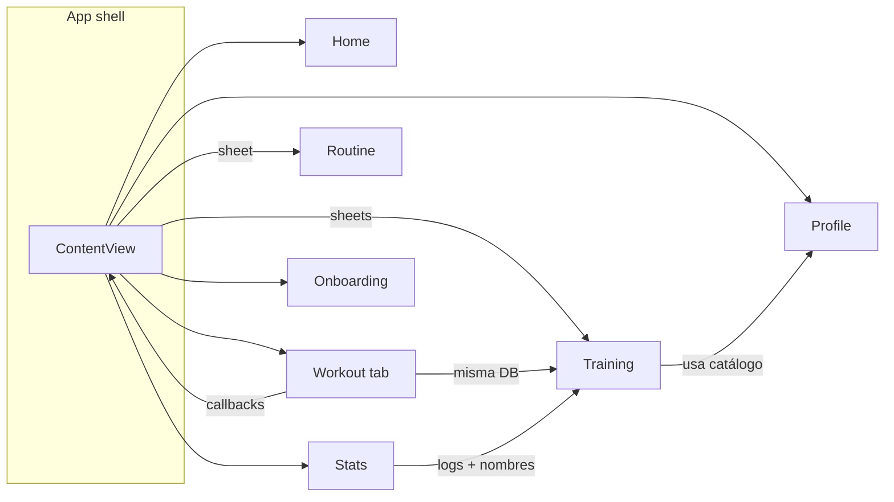

# Mapa de módulos (features)

“Módulo” = carpeta bajo `Super Fitness Coach App/Features/…` más el **shell** que las ensambla.  
**Dueño lógico** = dónde vive principalmente la toma de decisiones (no quién lo mantiene en el equipo).

---

## Shell de la app (no es `Features/`, pero orquesta todo)

| Dueño lógico | Archivos clave | Depende de |
|--------------|----------------|------------|
| **`ContentView`** compone tabs, sheets, creación de VMs y `WorkoutExecutorViewModel`. | `ContentView.swift`, `Super_Fitness_Coach_AppApp.swift` | Todos los features vía tabs/sheets; `Core/*` servicios; `Repositories/*`; `SwiftData` |

**Puntos frágiles:** mucha coordinación en un solo archivo; cambios en navegación o ciclo de vida del entreno suelen tocar aquí.

---

## `Features/Home/`

| Dueño lógico | Archivos clave | Depende de |
|--------------|----------------|------------|
| **`HomeViewModel`**: recuperación, coach, agenda de notificación diaria, historial local de recovery, integración detox en datos. **`HomeView`**: UI, `scenePhase`, textos localizados. | `HomeView.swift`, `HomeViewModel.swift` | `Core/HealthKitManager`, `Core/NotificationService`, `Core/GamificationEngine`, `Core/DetoxManager`, `Core/AICoach`, `Core/RecoveryAdapter`, agregadores de sueño, `Repositories/TrainingPlanRepository`, `UserProfileRepository`, `RecoverySnapshotRepository` |

**Puntos frágiles:** muchas dependencias en un solo VM; permisos y calidad de datos de HealthKit afectan toda la pantalla; lógica de detox acoplada al home.

---

## `Features/Workout/`

| Dueño lógico | Archivos clave | Depende de |
|--------------|----------------|------------|
| **`WorkoutView`**: tab Entreno; `@Query` al plan/rutina; dispara callbacks hacia `ContentView` (iniciar plan, rutina, abrir editor). | `WorkoutView.swift` | `SwiftData` (`TrainingPlan`, `UserRoutine`, …); `Features/Training/*` solo vía callbacks del padre; textos `AppLanguage` |

**Puntos frágiles:** la navegación real del entreno está en `ContentView`; esta vista debe mantenerse alineada con las claves de `@Query` y con los callbacks.

---

## `Features/Training/`

| Dueño lógico | Archivos clave | Depende de |
|--------------|----------------|------------|
| **`TrainingPlanViewModel`**: semana actual, estados de día, completar/saltar; usa `DayManager`. | `TrainingPlanView.swift`, `TrainingPlanViewModel.swift` | `Repositories/TrainingPlanRepository`, `Core/DayManager`, modelos de plan |
| **`TrainingPreferencesViewModel`**: preferencias → generación y guardado de plan. | `TrainingPreferencesView.swift`, `TrainingPreferencesViewModel.swift` | `ExerciseService`, `TrainingPlanRepository`, `UserProfileRepository`, `Core/TrainingPlanGenerator` (vía flujo de generación) |
| **`WorkoutExecutorViewModel`**: series, descanso, logs de sesión, notificación fin de descanso, completado global. | `WorkoutExecutorView.swift`, `WorkoutExecutorViewModel.swift` | `Core/SetLogger` → repo de plan, `HealthKitManager`, `NotificationService` (default `init` si no se inyecta), `Core/GymCoach`, modelos de ejercicio planificado |
| **Feedback post-entreno.** | `FeedbackView.swift`, `FeedbackViewModel.swift` | `WorkoutLog`, `TrainingPlanRepository`, `GamificationEngine` |
| **Detalle de ejercicio + media.** | `ExerciseDetailView.swift` | `ExerciseService.shared`, `SwiftData` (`ExerciseCatalogEntry`), `Core/SafariView`, `UnitConverter` / strings según UI |

**Puntos frágiles:** `WorkoutExecutorViewModel` es crítico (timer, finalización, logs); mezcla UIKit (haptics) y notificaciones; `TrainingPlanViewModel` usa snapshots para evitar problemas de SwiftData con SwiftUI—cualquier cambio en modelos de día/semana debe revisar `loadPlan`/`refreshState`.

---

## `Features/Routine/`

| Dueño lógico | Archivos clave | Depende de |
|--------------|----------------|------------|
| **`RoutineEditorView`** (y subvistas en el mismo archivo): edición de rutina, pickers, alternativas, persistencia rutina. | `RoutineEditorView.swift` | `SwiftData`, `UserRoutine` / días, `ExerciseService.shared` + `configure(modelContext:)`, catálogo local |

**Puntos frágiles:** archivo muy grande; acoplamiento fuerte a `ExerciseService` y a `@Query`; regresiones en picker o duplicados afectan UX de todo el flujo “Mi rutina”.

---

## `Features/Stats/`

| Dueño lógico | Archivos clave | Depende de |
|--------------|----------------|------------|
| **`StatsViewModel`**: puntos, rachas, badges, historial y resolución de nombres de ejercicio. **`StatsView`**: presentación. | `StatsView.swift`, `StatsViewModel.swift`, `WorkoutHistoryModels.swift` | `GamificationEngine`, `TrainingPlanRepository`, `ExerciseService` |

**Puntos frágiles:** nombres de ejercicios dependen del catálogo local y de `wgerUuid` en logs; si el catálogo está vacío o desincronizado, el historial muestra datos pobres.

---

## `Features/Profile/`

| Dueño lógico | Archivos clave | Depende de |
|--------------|----------------|------------|
| **`ProfileViewModel`**: perfil, métricas corporales, fitness config, sueño, HealthKit, notificaciones. **`ProfileView`**: UI + `@Query` del catálogo para estado de importación. | `ProfileView.swift`, `ProfileViewModel.swift` | `UserProfileRepository`, `HealthKitManager`, `NotificationService`, `SwiftData` (`ExerciseCatalogEntry`), `ExerciseCatalogImporter` (reimport manual) |

**Puntos frágiles:** permisos (HealthKit / notificaciones) y borrado/reimport del catálogo son operaciones sensibles; errores de import afectan resto de la app.

---

## `Features/Onboarding/`

| Dueño lógico | Archivos clave | Depende de |
|--------------|----------------|------------|
| **`OnboardingViewModel`**: pasos, HealthKit, perfil inicial, horario de sueño. **`OnboardingView`**: flujo UI. | `OnboardingView.swift`, `OnboardingViewModel.swift` | `UserProfileRepository`, `HealthKitManager`, modelos `FitnessGoal`, `UnitPreference`, etc. |

**Puntos frágiles:** define si existe `UserProfile` “completado”; inconsistencias aquí dejan al usuario fuera del `TabView` o con datos incompletos.

---

## `Features/Detox/`

| Dueño lógico | Archivos clave | Depende de |
|--------------|----------------|------------|
| **`DetoxViewModel`**: estado del reto; delega en `DetoxManager`. **`DetoxView`**: UI dedicada (si se presenta). | `DetoxView.swift`, `DetoxViewModel.swift` | `Core/DetoxManager`, `DetoxRepository` / `SwiftData` |

**Puntos frágiles:** lógica duplicada o paralela con la tarjeta de detox en Home; hay que mantener reglas de puntos/días alineadas.

---

## Capas compartidas (no son `Features/` pero las consume cada módulo)

| Carpeta | Rol |
|---------|-----|
| **`Core/`** | Servicios y lógica transversal: salud, notificaciones, catálogo, generación de plan, progresión, coach, utilidades. |
| **`Repositories/`** | Acceso a `ModelContext` para un dominio (plan, perfil, rutina, gamificación, detox, recovery). |
| **`Models/`** | Tipos SwiftData y value types del dominio (`TrainingPlan`, `WorkoutLog`, `Exercise`, `ExerciseCatalogEntry`, …). |

---

## Dependencias entre features (flujo típico)

Lectura: **no** hay imports directos `Features/A → Features/B` en muchos casos; el **acoplamiento pasa por `ContentView`**, `SwiftData` y servicios compartidos (`ExerciseService`, repos).

---

## Puntos frágiles globales

1. **`ContentView`** como único “router” y fábrica de `WorkoutExecutorViewModel`.
2. **`ExerciseService.shared`** debe estar `configure`’d antes de búsquedas/import; varias vistas lo reconfiguran en `onAppear`.
3. **Sesiones de entreno** en `UserDefaults` + `activeSessionId` en SwiftData: inconsistencias si cambian claves o semana actual.
4. **Catálogo** remoto (GitHub) + local SwiftData: red o import incompleto rompe pickers y nombres en Stats.
5. **`RoutineEditorView.swift`** tamaño y complejidad: alto riesgo de regresión en PRs grandes.

---

## Cómo validar este mapa

- Listar `Features/*/*.swift` y comparar con la tabla.
- Desde cada `*ViewModel` `init`, anotar dependencias y contrastar con las filas anteriores.
- Buscar `ExerciseService.shared` y `ContentView` en el proyecto para ver acoplamientos nuevos.
