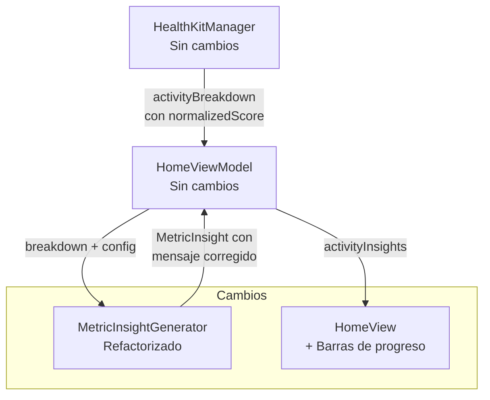

# Diseño — Insights de Progreso de Actividad

## Resumen

Este diseño corrige los mensajes de insight engañosos en la sección de Actividad del dashboard y agrega barras de progreso visual. El problema raíz es que `MetricInsightGenerator` usa `ComponentStatus` (que marca `.good` a partir de `normalizedScore >= 70`) para decidir el mensaje, lo que resulta en "meta cumplida" cuando el usuario solo ha alcanzado ~70% de su meta real.

Los cambios principales son:
1. **MetricInsightGenerator refactorizado**: Los métodos `stepsInsight` y `caloriesInsight` dejan de depender de `ComponentStatus` y en su lugar usan directamente el `normalizedScore` para determinar el mensaje correcto, con 4 rangos diferenciados.
2. **Barras de progreso en HomeView**: Se agrega un componente `ActivityProgressBar` que muestra visualmente la fracción `actual/meta` para pasos y calorías, con colores según el rango de avance.
3. **Mensajes motivacionales por nivel**: Se agregan mensajes motivacionales que varían según 5 rangos de `normalizedScore` (0-24, 25-49, 50-74, 75-99, 100+).

**Decisión clave**: No se modifica `componentStatus()` en `HealthKitManager` ni la lógica de scoring. El cambio es exclusivamente en la capa de presentación (`MetricInsightGenerator`) y la vista (`HomeView`). Esto preserva la integridad de los algoritmos de scoring existentes.

## Arquitectura

La arquitectura existente se mantiene. Los cambios se limitan a 3 archivos:



**Flujo de datos (sin cambios en el pipeline):**
1. `HealthKitManager.buildActivityBreakdown()` calcula `normalizedScore` como `min(100, actual/goal * 100)` — esto ya existe y no se toca.
2. `HomeViewModel` pasa el breakdown a `MetricInsightGenerator.generateInsights()`.
3. `MetricInsightGenerator` ahora usa `normalizedScore` directamente (en vez de solo `ComponentStatus`) para elegir el mensaje.
4. `HomeView` muestra los insights y las nuevas barras de progreso.

**¿Por qué no modificar `componentStatus()`?** La función `componentStatus()` se usa para recovery y actividad. Cambiar sus umbrales afectaría los colores de recovery (sueño, FC, HRV), que funcionan correctamente con los umbrales actuales. El problema es específico de la interpretación de "meta cumplida" en actividad.

## Componentes e Interfaces

### 1. MetricInsightGenerator (refactorizado)

Los métodos `stepsInsight` y `caloriesInsight` se refactorizan para usar `normalizedScore` directamente:

```swift
// MetricInsightGenerator.swift — cambios en stepsInsight y caloriesInsight

private static func stepsInsight(
    for component: ScoreBreakdown.ScoreComponent,
    config: FitnessConfig
) -> MetricInsight {
    let steps = Int(component.rawValue)
    let goal = Int(config.stepsGoal)
    let score = component.normalizedScore

    let message: String
    if score >= 100 {
        message = "¡Meta cumplida! \(formatInt(steps)) pasos hoy ✓"
    } else if score >= 70 {
        message = "\(formatInt(steps)) de \(formatInt(goal)) pasos — ¡ya casi llegas! 💪"
    } else if score >= 40 {
        message = "\(formatInt(steps)) de \(formatInt(goal)) pasos — vas bien"
    } else {
        message = "Llevas \(formatInt(steps)) de \(formatInt(goal)) pasos — ¡a moverse! 🚶"
    }

    return MetricInsight(metricName: "Pasos", message: message, status: component.status)
}

private static func caloriesInsight(
    for component: ScoreBreakdown.ScoreComponent,
    config: FitnessConfig
) -> MetricInsight {
    let cals = Int(component.rawValue)
    let goal = Int(config.calorieGoal)
    let score = component.normalizedScore

    let message: String
    if score >= 100 {
        message = "Meta de calorías cumplida: \(cals) kcal ✓"
    } else if score >= 70 {
        message = "\(cals) de \(goal) kcal activas — ¡casi lo logras! 🔥"
    } else if score >= 40 {
        message = "\(cals) de \(goal) kcal activas — en progreso"
    } else {
        message = "\(cals) de \(goal) kcal activas — aún queda camino"
    }

    return MetricInsight(metricName: "Calorías", message: message, status: component.status)
}
```

**Cambio clave**: Se reemplaza el `switch component.status` por condicionales sobre `component.normalizedScore`. Esto desacopla el mensaje del `ComponentStatus` y permite reservar "meta cumplida" exclusivamente para `normalizedScore >= 100`.

### 2. MetricInsightGenerator — Mensajes motivacionales

Se agrega un método estático que genera el sufijo motivacional según el nivel de avance:

```swift
/// Retorna un mensaje motivacional según el rango de normalizedScore.
/// Solo aplica a métricas de actividad (pasos, calorías).
static func motivationalSuffix(for normalizedScore: Double) -> String {
    switch normalizedScore {
    case ..<25:    return "¡Cada paso cuenta!"
    case 25..<50:  return "¡Buen arranque!"
    case 50..<75:  return "¡Más de la mitad!"
    case 75..<100: return "¡Ya casi!"
    default:       return "¡Meta cumplida! 🎉"
    }
}
```

Este sufijo se integra en los mensajes de `stepsInsight` y `caloriesInsight` para los rangos intermedios (< 100).

### 3. HomeView — Barra de progreso (nuevo componente)

Se agrega un componente reutilizable `ActivityProgressBar` dentro de `HomeView`:

```swift
/// Barra de progreso para métricas de actividad.
private func activityProgressBar(
    progress: Double,       // normalizedScore / 100, clamped a [0, 1]
    normalizedScore: Double,
    accessibilityLabel: String
) -> some View {
    GeometryReader { geo in
        ZStack(alignment: .leading) {
            Capsule()
                .fill(Color(.systemGray4))
                .frame(height: 6)
            Capsule()
                .fill(progressBarColor(for: normalizedScore))
                .frame(width: geo.size.width * min(max(progress, 0), 1), height: 6)
        }
    }
    .frame(height: 6)
    .accessibilityElement()
    .accessibilityLabel(accessibilityLabel)
}

private func progressBarColor(for normalizedScore: Double) -> Color {
    if normalizedScore >= 100 { return .green }
    if normalizedScore >= 40 { return .blue }
    return .orange
}
```

La barra se integra en `insightsBreakdownView` debajo de cada insight de actividad (Steps y Active Calories), visible cuando la sección de detalles está expandida.

### 4. HomeView — Integración de barras en insightsBreakdownView

Se modifica `insightRow` para aceptar un `normalizedScore` opcional y mostrar la barra cuando corresponda:

```swift
private func insightRow(insight: MetricInsight, normalizedScore: Double? = nil) -> some View {
    VStack(alignment: .leading, spacing: 4) {
        HStack(alignment: .top, spacing: 8) {
            Circle()
                .fill(statusColor(for: insight.status))
                .frame(width: 8, height: 8)
                .padding(.top, 6)
            Text(insight.message)
                .font(.subheadline)
                .foregroundStyle(.primary)
                .frame(maxWidth: .infinity, alignment: .leading)
        }
        if let score = normalizedScore {
            activityProgressBar(
                progress: score / 100.0,
                normalizedScore: score,
                accessibilityLabel: "Progreso de \(insight.metricName): \(Int(min(score, 100))) por ciento"
            )
            .padding(.leading, 16)
        }
    }
    .accessibilityElement(children: .combine)
    .accessibilityLabel("\(insight.metricName): \(insight.message)")
}
```

Para pasar el `normalizedScore` a la vista, `MetricInsight` necesita exponer este dato. Se agrega un campo opcional.

## Modelos de Datos

### MetricInsight (modificado)

Se agrega `normalizedScore` como campo opcional para que la vista pueda renderizar la barra de progreso:

```swift
struct MetricInsight {
    let metricName: String
    let message: String
    let status: ScoreBreakdown.ComponentStatus
    let normalizedScore: Double?  // Nuevo: para barras de progreso en la vista
    
    init(metricName: String, message: String, status: ScoreBreakdown.ComponentStatus, normalizedScore: Double? = nil) {
        self.metricName = metricName
        self.message = message
        self.status = status
        self.normalizedScore = normalizedScore
    }
}
```

**Decisión**: Se agrega `normalizedScore` a `MetricInsight` en vez de a `ScoreComponent` porque:
- `ScoreComponent` ya tiene `normalizedScore` — pero `MetricInsight` es lo que la vista consume.
- Agregar el campo a `MetricInsight` evita que la vista tenga que buscar el componente correspondiente en el breakdown.
- El valor default `nil` mantiene backward compatibility para insights de recovery que no necesitan barra.

### Modelos existentes sin cambios

- `ScoreBreakdown` / `ScoreComponent` — sin modificaciones
- `FitnessConfig` — sin cambios
- `HealthDataStatus<T>` — sin cambios
- `HomeViewModel` — sin cambios (ya expone `activityInsights: [MetricInsight]`)

### Mapeo de normalizedScore a mensajes

| Métrica | normalizedScore | Mensaje | Estado |
|---------|----------------|---------|--------|
| Pasos | >= 100 | "¡Meta cumplida! X pasos hoy ✓" | `.good` |
| Pasos | 70-99 | "X de Y pasos — ¡ya casi llegas! 💪" | `.good` |
| Pasos | 40-69 | "X de Y pasos — vas bien" | `.normal` |
| Pasos | < 40 | "Llevas X de Y pasos — ¡a moverse! 🚶" | `.warning` |
| Calorías | >= 100 | "Meta de calorías cumplida: X kcal ✓" | `.good` |
| Calorías | 70-99 | "X de Y kcal activas — ¡casi lo logras! 🔥" | `.good` |
| Calorías | 40-69 | "X de Y kcal activas — en progreso" | `.normal` |
| Calorías | < 40 | "X de Y kcal activas — aún queda camino" | `.warning` |

### Mapeo de normalizedScore a color de barra

| normalizedScore | Color |
|----------------|-------|
| >= 100 | Verde (`.green`) |
| 40-99 | Azul (`.blue`) |
| < 40 | Naranja (`.orange`) |

### Mapeo de normalizedScore a mensaje motivacional

| normalizedScore | Mensaje motivacional |
|----------------|---------------------|
| 0-24 | "¡Cada paso cuenta!" |
| 25-49 | "¡Buen arranque!" |
| 50-74 | "¡Más de la mitad!" |
| 75-99 | "¡Ya casi!" |
| >= 100 | "¡Meta cumplida! 🎉" |


## Propiedades de Correctitud

*Una propiedad es una característica o comportamiento que debe cumplirse en todas las ejecuciones válidas de un sistema — esencialmente, una declaración formal sobre lo que el sistema debe hacer. Las propiedades sirven como puente entre especificaciones legibles por humanos y garantías de correctitud verificables por máquina.*

Las propiedades 1-4 de los requisitos de pasos y calorías siguen el mismo patrón: para cada rango de `normalizedScore`, el mensaje generado debe contener las palabras clave correctas. Las propiedades de color de barra (3.3-3.5, 4.3-4.5) comparten la misma función `progressBarColor`. Las propiedades motivacionales (5.1-5.5) se consolidan en una sola. La propiedad 6.1 queda subsumida por 6.2 (si "meta cumplida" se reserva para >= 100, necesariamente se usa `normalizedScore` y no solo `ComponentStatus`).

### Propiedad 1: Mensaje de pasos mapea correctamente al rango de normalizedScore

*Para cualquier* `ScoreComponent` con nombre "Steps", valor `rawValue` en [0, 50000], meta `stepsGoal` en [1000, 50000], y `normalizedScore` en [0, 100]: si `normalizedScore >= 100` el mensaje debe contener "Meta cumplida"; si está en [70, 99] debe contener "ya casi llegas"; si está en [40, 69] debe contener "vas bien"; si es < 40 debe contener "a moverse".

**Valida: Requisitos 1.1, 1.2, 1.3, 1.4**

### Propiedad 2: Mensaje de calorías mapea correctamente al rango de normalizedScore

*Para cualquier* `ScoreComponent` con nombre "Active Calories", valor `rawValue` en [0, 2000], meta `calorieGoal` en [100, 2000], y `normalizedScore` en [0, 100]: si `normalizedScore >= 100` el mensaje debe contener "Meta de calorías cumplida"; si está en [70, 99] debe contener "casi lo logras"; si está en [40, 69] debe contener "en progreso"; si es < 40 debe contener "aún queda camino".

**Valida: Requisitos 2.1, 2.2, 2.3, 2.4**

### Propiedad 3: Fracción de barra de progreso está limitada a [0, 1]

*Para cualquier* valor de `normalizedScore` (incluyendo valores extremos como 0, 150, negativos), la fracción de progreso calculada como `min(max(normalizedScore / 100, 0), 1)` debe estar en el rango [0.0, 1.0].

**Valida: Requisitos 3.2, 4.2**

### Propiedad 4: Color de barra de progreso mapea correctamente al rango de normalizedScore

*Para cualquier* `normalizedScore`: si es >= 100 el color debe ser verde; si está en [40, 99] el color debe ser azul; si es < 40 el color debe ser naranja.

**Valida: Requisitos 3.3, 3.4, 3.5, 4.3, 4.4, 4.5**

### Propiedad 5: Mensaje motivacional mapea correctamente al rango de normalizedScore

*Para cualquier* `normalizedScore` en [0, 100+]: si es < 25 el sufijo debe ser "¡Cada paso cuenta!"; si está en [25, 50) debe ser "¡Buen arranque!"; si está en [50, 75) debe ser "¡Más de la mitad!"; si está en [75, 100) debe ser "¡Ya casi!"; si es >= 100 debe ser "¡Meta cumplida! 🎉".

**Valida: Requisitos 5.1, 5.2, 5.3, 5.4, 5.5**

### Propiedad 6: "Meta cumplida" se reserva exclusivamente para normalizedScore >= 100

*Para cualquier* `ScoreComponent` de actividad (Steps o Active Calories) con `normalizedScore < 100`, el mensaje generado por `MetricInsightGenerator` NO debe contener la frase "meta cumplida" (case-insensitive). Inversamente, para cualquier componente con `normalizedScore >= 100`, el mensaje DEBE contener "meta cumplida" o "Meta cumplida".

**Valida: Requisitos 6.1, 6.2**

### Propiedad 7: Generación de insights es determinista

*Para cualquier* `ScoreComponent` y `FitnessConfig` válidos, invocar `MetricInsightGenerator.generateInsight()` dos veces con los mismos parámetros debe producir un `MetricInsight` con `message` idéntico.

**Valida: Requisito 6.3**

## Manejo de Errores

### Valores extremos

| Escenario | Comportamiento |
|---|---|
| `normalizedScore` = 0 | Se trata como rango bajo (< 40). Mensaje motivacional de inicio. Barra naranja casi vacía. |
| `normalizedScore` > 100 | Se trata como meta cumplida (>= 100). Barra verde completamente llena (fracción clamped a 1.0). |
| `stepsGoal` o `calorieGoal` = 0 | `buildActivityBreakdown` ya maneja esto (normalizedScore = 0). El insight muestra mensaje de rango bajo. |
| `rawValue` = 0 | Mensaje muestra "0 de Y pasos" o "0 de Y kcal". Barra vacía. Comportamiento correcto. |

### Backward compatibility

| Escenario | Comportamiento |
|---|---|
| Insights de recovery (Sleep, HR, HRV) | No se modifican. Siguen usando `component.status` como antes. |
| `MetricInsight` sin `normalizedScore` | El campo es opcional (`nil`). La vista no muestra barra de progreso. |
| `activityBreakdown` es `nil` | `activityInsights` es array vacío. No se muestran barras. Sin cambios. |

## Estrategia de Testing

### Enfoque dual

Se utilizan tanto tests unitarios como tests basados en propiedades:

- **Tests unitarios**: Verifican ejemplos específicos en los boundaries (normalizedScore = 39, 40, 69, 70, 99, 100) y edge cases (rawValue = 0, goal extremo).
- **Tests de propiedades**: Verifican las 7 propiedades universales definidas arriba con inputs generados aleatoriamente.

### Librería de Property-Based Testing

Se usará `swift-testing` con un generador seeded custom (patrón ya establecido en `SleepWindowValidationPropertyTests.swift`). Cada test ejecutará un mínimo de 100 iteraciones.

### Generadores necesarios

```swift
// Generadores para property-based testing
- normalizedScore: Double aleatorio en [0, 120] (incluye valores > 100)
- rawValue para Steps: Double aleatorio en [0, 50000]
- rawValue para Calories: Double aleatorio en [0, 2000]
- stepsGoal: Double aleatorio en [1000, 50000]
- calorieGoal: Double aleatorio en [100, 2000]
- ScoreComponent: construido con name fijo ("Steps" o "Active Calories"),
                   rawValue/rawUnit coherentes, normalizedScore aleatorio,
                   status derivado de normalizedScore via componentStatus()
- FitnessConfig: stepsGoal y calorieGoal aleatorios dentro de rangos válidos
```

### Estructura de tests

```
Tests/
├── PropertyTests/
│   └── ActivityProgressInsightsPropertyTests.swift
│       — Propiedades 1-7 con 100+ iteraciones cada una
├── UnitTests/
│   └── ActivityProgressInsightsUnitTests.swift
│       — Ejemplos boundary y edge cases
```

### Etiquetado de tests de propiedades

Cada test de propiedad debe incluir un comentario con el formato:
```swift
// Feature: activity-progress-insights, Property 1: Mensaje de pasos mapea correctamente al rango de normalizedScore
```

### Tests unitarios clave (ejemplos y edge cases)

| Test | Tipo | Valida |
|---|---|---|
| Steps con normalizedScore = 100 muestra "Meta cumplida" | Boundary | Req 1.1 |
| Steps con normalizedScore = 99 NO muestra "Meta cumplida" | Boundary | Req 1.2, 6.2 |
| Steps con normalizedScore = 70 muestra "ya casi llegas" | Boundary | Req 1.2 |
| Steps con normalizedScore = 39 muestra "a moverse" | Boundary | Req 1.4 |
| Calories con normalizedScore = 100 muestra "Meta de calorías cumplida" | Boundary | Req 2.1 |
| Calories con normalizedScore = 99 NO muestra "meta cumplida" | Boundary | Req 2.2, 6.2 |
| Steps con rawValue = 0 y goal = 10000 | Edge case | Robustez |
| motivationalSuffix con normalizedScore = 0 | Edge case | Req 5.1 |
| motivationalSuffix con normalizedScore = 100 | Boundary | Req 5.5 |
| progressBarColor con normalizedScore = 40 (boundary) | Boundary | Req 3.4 |
| progressBarColor con normalizedScore = 39 (boundary) | Boundary | Req 3.5 |
