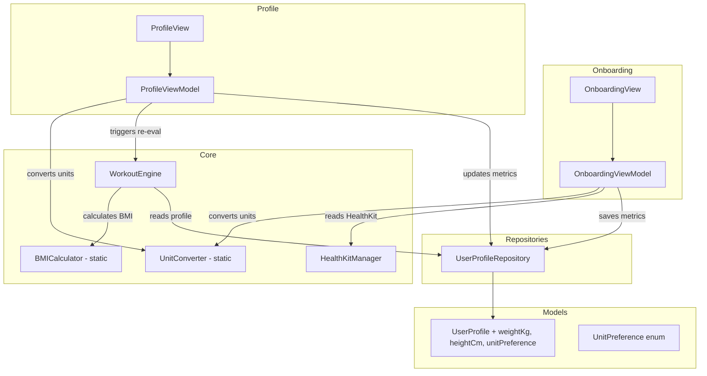

# Design Document: Body Metrics Onboarding

## Overview

This feature extends the Super Fitness Coach App to collect, persist, and utilize body metrics (weight and height) for workout personalization. It touches four layers of the app:

1. **Onboarding** — A new `bodyMetrics` step is inserted between `.goal` and `.health` in `OnboardingStep`, collecting weight, height, and unit preference with locale auto-detection and optional HealthKit import.
2. **Model & Persistence** — `UserProfile` gains three new fields (`weightKg`, `heightCm`, `unitPreference`) stored via SwiftData, always persisted in metric units.
3. **Profile Editing** — `ProfileView` gets a new body metrics section with inline editing, validation, and automatic workout re-evaluation on save.
4. **Workout Personalization** — `WorkoutEngine` uses BMI derived from the stored metrics to adjust sets, reps, and weekly distribution per BMI category.
5. **HealthKit Integration** — `HealthKitManager` adds `bodyMass` and `height` to its read types and exposes query methods to pre-fill onboarding fields.

The design preserves the existing architecture patterns: `@Observable` ViewModels, SwiftData `@Model` entities, static pure functions for testable logic, and repository-mediated persistence.

## Architecture



### Key Design Decisions

1. **Always store metric internally** — Weight in kg, height in cm. Conversion happens only at the display/input boundary via pure static functions in `UnitConverter`. This avoids accumulated rounding errors from repeated conversions.

2. **Static pure functions for BMI and unit conversion** — `UnitConverter` and the BMI calculation are static methods with no side effects, making them directly testable with property-based tests.

3. **Insert onboarding step via enum case** — Add `.bodyMetrics` case with raw value 2, shifting `.health` to 3. The progress indicator already iterates `OnboardingStep.allCases`, so it auto-adapts.

4. **HealthKit pre-fill is opportunistic** — If HealthKit authorization was granted in a previous step or session, the body metrics step queries for latest samples. If unavailable, fields remain empty for manual entry. No blocking flow.

5. **BMI adjustment is additive** — The existing `distribution(for:)` and `adjustedWorkout(...)` logic is preserved. BMI adjustments layer on top: modifying base sets/reps and optionally swapping workout types in the distribution for extreme BMI categories.

6. **Backward compatibility** — New `UserProfile` fields use optional Doubles with nil defaults. Existing profiles without metrics trigger the fallback path (goal-only plan generation).

## Components and Interfaces

### UnitPreference Enum

```swift
// Models/UnitPreference.swift
enum UnitPreference: String, Codable, CaseIterable {
    case metric
    case imperial
}
```

### UnitConverter (Static Pure Functions)

```swift
// Core/UnitConverter.swift
struct UnitConverter {
    // Weight
    static func kgToLbs(_ kg: Double) -> Double { kg * 2.20462 }
    static func lbsToKg(_ lbs: Double) -> Double { lbs / 2.20462 }

    // Height
    static func cmToFeetInches(_ cm: Double) -> (feet: Int, inches: Double) {
        let totalInches = cm / 2.54
        let feet = Int(totalInches) / 12
        let inches = totalInches - Double(feet * 12)
        return (feet, inches)
    }
    static func feetInchesToCm(feet: Int, inches: Double) -> Double {
        (Double(feet) * 12.0 + inches) * 2.54
    }

    // Locale detection
    static func defaultPreference(for locale: Locale = .current) -> UnitPreference {
        locale.measurementSystem == .us ? .imperial : .metric
    }
}
```

### BMI Calculation (Static on WorkoutEngine)

```swift
// Extension on WorkoutEngine
extension WorkoutEngine {
    enum BMICategory {
        case underweight  // < 18.5
        case normal       // 18.5–24.9
        case overweight   // 25–29.9
        case obese        // >= 30
    }

    static func calculateBMI(weightKg: Double, heightCm: Double) -> Double {
        let heightM = heightCm / 100.0
        guard heightM > 0 else { return 0 }
        return weightKg / (heightM * heightM)
    }

    static func bmiCategory(bmi: Double) -> BMICategory {
        switch bmi {
        case ..<18.5: return .underweight
        case 18.5..<25: return .normal
        case 25..<30: return .overweight
        default: return .obese
        }
    }
}
```

### OnboardingStep Changes

```swift
enum OnboardingStep: Int, CaseIterable {
    case name = 0
    case goal = 1
    case bodyMetrics = 2  // NEW
    case health = 3       // was 2
}
```

### OnboardingViewModel Additions

New properties:
- `weightInput: String` — raw text field binding
- `heightInput: String` — raw text field binding (cm or total for imperial)
- `heightFeetInput: String` — feet portion for imperial
- `heightInchesInput: String` — inches portion for imperial
- `unitPreference: UnitPreference` — initialized via `UnitConverter.defaultPreference()`
- `isHealthKitMetricsLoaded: Bool`
- `healthKitMetricsLabel: String?`

New methods:
- `loadHealthKitMetrics()` — queries HealthKitManager for latest bodyMass/height
- `switchUnitPreference(_ newPref: UnitPreference)` — converts current input values
- `canProceedFromBodyMetrics: Bool` — validates both fields are valid positive numbers

### HealthKitManager Additions

New read types added to `requestAuthorization()`:
- `HKQuantityType(.bodyMass)`
- `HKQuantityType(.height)`

New methods:
- `func queryLatestWeight() async -> Double?` — returns most recent bodyMass in kg
- `func queryLatestHeight() async -> Double?` — returns most recent height in cm

### ProfileViewModel Additions

New properties:
- `weightDisplay: String` — formatted for current unit preference
- `heightDisplay: String` — formatted for current unit preference
- `unitPreference: UnitPreference`
- `isEditingBodyMetrics: Bool`
- `bodyMetricsValidationError: String?`

New methods:
- `updateBodyMetrics(weightInput: String, heightInput: String, ...)` — validates, converts, persists, triggers workout re-evaluation
- `switchUnitPreference(_ newPref: UnitPreference)` — converts display values

### WorkoutEngine Changes

Modified methods:
- `generateWeeklyPlan(goal:weightKg:heightCm:)` — new overload accepting optional body metrics
- `distribution(for:bmiCategory:)` — private, adjusts type distribution for underweight/obese
- `adjustedWorkout(...)` — uses BMI to modify `baseSets` and `baseReps`

New static methods:
- `calculateBMI(weightKg:heightCm:) -> Double`
- `bmiCategory(bmi:) -> BMICategory`
- `adjustedSetsReps(baseSets:baseReps:bmiCategory:) -> (sets: Int, reps: Int)`

## Data Models

### UserProfile (Updated)

```swift
@Model
final class UserProfile {
    @Attribute(.unique) var id: UUID
    var name: String
    var fitnessGoal: FitnessGoal
    var onboardingCompleted: Bool
    var createdAt: Date

    // New body metrics fields
    var weightKg: Double?       // Always stored in kg
    var heightCm: Double?       // Always stored in cm
    var unitPreference: UnitPreference?  // nil = not yet set

    init(name: String, fitnessGoal: FitnessGoal,
         weightKg: Double? = nil, heightCm: Double? = nil,
         unitPreference: UnitPreference? = nil) {
        self.id = UUID()
        self.name = name
        self.fitnessGoal = fitnessGoal
        self.onboardingCompleted = true
        self.createdAt = Date()
        self.weightKg = weightKg
        self.heightCm = heightCm
        self.unitPreference = unitPreference
    }
}
```

New fields are optional Doubles/enum, so SwiftData handles schema migration automatically — existing rows get `nil` defaults, which triggers the fallback path in `WorkoutEngine`.

### BMICategory Enum

```swift
enum BMICategory: String, Codable {
    case underweight
    case normal
    case overweight
    case obese
}
```

### BMI-Based Adjustments Table

| BMI Category | Sets Modifier | Reps Modifier | Distribution Change |
|---|---|---|---|
| Underweight (<18.5) | base | base | -1 cardio, +1 strength |
| Normal (18.5–24.9) | base (4) | base (12) | No change |
| Overweight (25–29.9) | base (4) | base (12) | No change |
| Obese (≥30) | base - 1 (min 2) | base - 2 (min 8) | -1 high-intensity strength, +1 low-impact cardio |

### Unit Conversion Constants

| Conversion | Formula | Round-trip tolerance |
|---|---|---|
| kg → lbs | kg × 2.20462 | ±0.1 kg |
| lbs → kg | lbs ÷ 2.20462 | ±0.1 kg |
| cm → ft/in | totalInches = cm ÷ 2.54; feet = totalInches ÷ 12 | ±0.5 cm |
| ft/in → cm | (feet × 12 + inches) × 2.54 | ±0.5 cm |


## Correctness Properties

*A property is a characteristic or behavior that should hold true across all valid executions of a system — essentially, a formal statement about what the system should do. Properties serve as the bridge between human-readable specifications and machine-verifiable correctness guarantees.*

### Property 1: Weight conversion round-trip

*For any* valid weight value `w` in kilograms (where `w > 0`), converting to pounds via `kgToLbs(w)` and back via `lbsToKg(kgToLbs(w))` shall produce a result within 0.1 kg of the original value `w`.

**Validates: Requirements 6.5, 1.4, 3.5**

### Property 2: Height conversion round-trip

*For any* valid height value `h` in centimeters (where `h > 0`), converting to feet-inches via `cmToFeetInches(h)` and back via `feetInchesToCm(cmToFeetInches(h))` shall produce a result within 0.5 cm of the original value `h`.

**Validates: Requirements 6.6, 1.4, 3.5**

### Property 3: Body metrics validation rejects invalid inputs

*For any* input string that is non-numeric, or represents a value that is zero or negative, the body metrics validation function shall return false, and the current state (stored weight and height) shall remain unchanged.

**Validates: Requirements 1.5, 3.6**

### Property 4: Imperial inputs stored as correct metric equivalents

*For any* weight entered in pounds and height entered in feet-inches, the values persisted in `UserProfile.weightKg` and `UserProfile.heightCm` shall equal `lbsToKg(lbs)` and `feetInchesToCm(feet, inches)` respectively.

**Validates: Requirements 2.1, 2.2, 2.5**

### Property 5: BMI formula correctness

*For any* valid weight `w` (kg, w > 0) and height `h` (cm, h > 0), `calculateBMI(weightKg: w, heightCm: h)` shall equal `w / (h / 100.0)²`.

**Validates: Requirements 4.1**

### Property 6: BMI category determines correct workout adjustments

*For any* valid weight and height producing a BMI value, the workout distribution and sets/reps adjustments shall match the expected modification for the corresponding BMI category: underweight reduces cardio and increases strength; obese reduces high-intensity strength sets and increases low-impact cardio; normal and overweight produce no modification to the goal-based distribution.

**Validates: Requirements 4.2, 4.3, 4.4, 4.5**

### Property 7: Body metrics persistence round-trip

*For any* valid weight (kg), height (cm), and unit preference, saving them to `UserProfile` via the repository and then fetching the profile shall return the same weight, height, and unit preference values.

**Validates: Requirements 2.4, 3.3**

### Property 8: Unit preference persistence round-trip

*For any* `UnitPreference` value (metric or imperial), persisting it to `UserProfile` and fetching it back shall return the same enum value.

**Validates: Requirements 6.4**

## Error Handling

| Scenario | Handling |
|---|---|
| Invalid weight/height input (non-numeric, ≤ 0) | Validation rejects save; previous valid value retained; inline error message displayed |
| HealthKit authorization denied | Body metrics fields left empty for manual entry; no error shown, graceful degradation |
| HealthKit returns nil for bodyMass/height | Corresponding field left empty; user enters manually |
| Missing weight or height in UserProfile | WorkoutEngine falls back to goal-only plan generation (no BMI adjustments) |
| Height is zero (division by zero in BMI) | `calculateBMI` returns 0; treated as missing metrics, fallback to goal-only |
| SwiftData save failure | Repository retries once (existing pattern); logs error; UI shows generic save error |
| Locale detection fails | Defaults to `.metric` as the safe fallback |

## Testing Strategy

### Unit Tests

Unit tests verify specific examples, edge cases, and integration points:

- **OnboardingStep ordering**: Verify `.bodyMetrics` is at index 2, `.health` at index 3, `allCases.count == 4`
- **Locale detection**: Verify US locale → imperial, FR locale → metric, fallback → metric
- **BMI edge cases**: Height = 0 returns 0, very small/large values produce correct categories
- **Validation edge cases**: Empty string, whitespace, negative numbers, zero, non-numeric strings all rejected
- **HealthKit type inclusion**: Verify `bodyMass` and `height` are in the read types set
- **Missing metrics fallback**: Verify WorkoutEngine with nil weight/height produces same plan as goal-only
- **Profile update triggers re-evaluation**: Verify that saving new metrics calls `generateWeeklyPlan`

### Property-Based Tests

Property-based tests verify universal properties across randomized inputs. The project will use **SwiftCheck** (already referenced in the PropertyTests placeholder) as the PBT library.

Each property test must:
- Run a minimum of **100 iterations**
- Reference its design property with a tag comment in the format: `Feature: body-metrics-onboarding, Property {number}: {title}`
- Be implemented as a **single property-based test per correctness property**

Properties to implement:

1. **Weight conversion round-trip** (Property 1) — Generate random weights in [0.1, 500.0] kg, verify `lbsToKg(kgToLbs(w))` is within 0.1 of `w`
2. **Height conversion round-trip** (Property 2) — Generate random heights in [30.0, 300.0] cm, verify `feetInchesToCm(cmToFeetInches(h))` is within 0.5 of `h`
3. **Validation rejects invalid inputs** (Property 3) — Generate random invalid strings (empty, whitespace, letters, zero, negatives), verify validation returns false
4. **Imperial storage conversion** (Property 4) — Generate random lbs/ft-in values, verify stored kg/cm equals conversion function output
5. **BMI formula** (Property 5) — Generate random weight [1, 500] and height [30, 300], verify `calculateBMI` equals `w / (h/100)²`
6. **BMI category workout adjustments** (Property 6) — Generate random weight/height across all BMI categories, verify distribution and sets/reps match category rules
7. **Persistence round-trip** (Property 7) — Generate random valid metrics, save and fetch, verify equality
8. **Unit preference round-trip** (Property 8) — Generate random UnitPreference, save and fetch, verify equality

### Test Organization

```
Tests/
├── UnitTests/
│   ├── UnitConverterTests.swift
│   ├── BMICalculationTests.swift
│   ├── BodyMetricsValidationTests.swift
│   └── OnboardingStepTests.swift
└── PropertyTests/
    ├── UnitConversionPropertyTests.swift
    ├── BMIPropertyTests.swift
    └── BodyMetricsPersistencePropertyTests.swift
```
