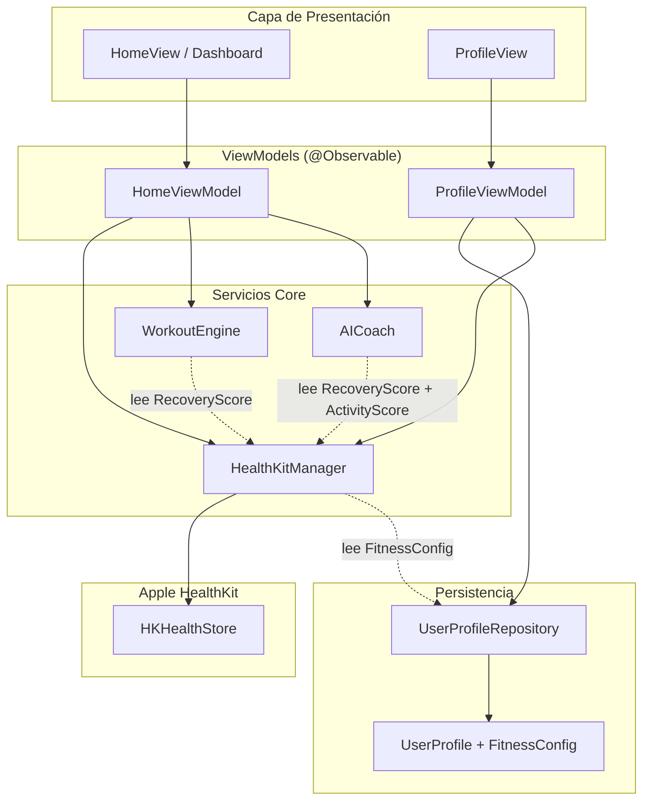
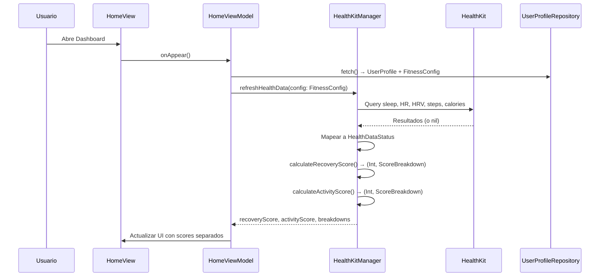
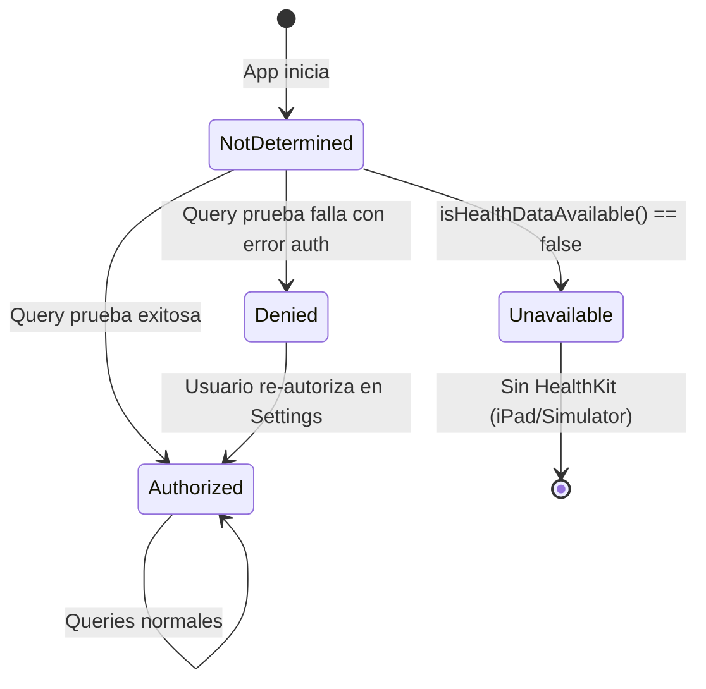

# Documento de Diseño: Smart Fitness Coach

## Visión General

Este diseño describe la refactorización completa del sistema de scoring de fitness y la integración con HealthKit. El objetivo es transformar el `HealthKitManager` actual — que mezcla recuperación y actividad en un solo score, usa valores hardcodeados, enmascara datos ausentes con defaults falsos, y tiene un flujo de autorización roto — en un sistema de scoring de nivel competitivo comparable a Whoop/Oura.

Los cambios principales son:

1. **FitnessConfig en UserProfile**: Metas personalizadas del usuario (sueño, pasos, calorías, HR baseline, nivel de fitness) persistidas en SwiftData.
2. **Scores separados**: `RecoveryScore` (sueño + HR reposo + HRV) y `ActivityScore` (pasos + calorías) como valores independientes.
3. **HRV**: Lectura de `heartRateVariabilitySDNN` de HealthKit con normalización lineal y fallback con redistribución de pesos.
4. **HR contra baseline personal**: Fórmula basada en porcentaje `100 - (percentageChange × 100 × 2.5)` en lugar de escala arbitraria de rango fijo.
5. **Sueño ponderado**: Duración (50%) + deep sleep % (25%) + REM % (25%) basados en porcentaje del total de sueño, con fallback a solo duración.
6. **Autorización real**: Query de prueba en lugar de `isAuthorized = true` incondicional. Enum `AuthorizationStatus`.
7. **HealthDataStatus**: Enum `.available(Double)` / `.unavailable` / `.loading` que elimina defaults falsos.
8. **Score Breakdown**: Estructura explicable con valor raw, score normalizado, peso, y contribución por componente.
9. **Integración WorkoutEngine**: Usa `RecoveryScore` (no el score combinado) para ajustes diarios.
10. **Normalización basada en metas**: Todas las funciones de normalización usan `FitnessConfig` del usuario.

### Principios de Diseño

- **Funciones estáticas puras** para toda la lógica de cálculo (testeable sin HealthKit ni SwiftData).
- **@Observable ViewModels** como capa de presentación, sin lógica de negocio.
- **Repository pattern** para persistencia SwiftData.
- **Composición sobre herencia**: structs para datos, clases solo para @Model y @Observable.

## Arquitectura



### Flujo de Datos Principal



## Componentes e Interfaces

### 1. HealthKitManager (refactorizado)

El `HealthKitManager` se refactoriza para separar la lógica pura de cálculo (funciones `static`) de la interacción con HealthKit (métodos de instancia `async`).

```swift
@Observable
final class HealthKitManager {
    // Estado observable
    private(set) var authorizationStatus: AuthorizationStatus = .notDetermined
    private(set) var recoveryScore: HealthDataStatus<Int> = .loading
    private(set) var activityScore: HealthDataStatus<Int> = .loading
    private(set) var recoveryBreakdown: ScoreBreakdown?
    private(set) var activityBreakdown: ScoreBreakdown?

    // Métricas individuales
    private(set) var sleepHours: HealthDataStatus<Double> = .loading
    private(set) var deepSleepHours: HealthDataStatus<Double> = .loading
    private(set) var remSleepHours: HealthDataStatus<Double> = .loading
    private(set) var restingHR: HealthDataStatus<Double> = .loading
    private(set) var hrv: HealthDataStatus<Double> = .loading
    private(set) var stepCount: HealthDataStatus<Double> = .loading
    private(set) var activeEnergy: HealthDataStatus<Double> = .loading

    // --- Autorización ---
    func requestAuthorization() async throws
    func verifyAuthorization() async

    // --- Refresh ---
    func refreshHealthData(config: FitnessConfig) async

    // --- Funciones estáticas puras (toda la lógica de scoring) ---

    /// Recovery Score: pesos sleep 0.45, HR 0.25, HRV 0.30
    static func calculateRecoveryScore(
        sleepQualityScore: Double,
        restingHRScore: Double,
        hrvScore: Double?
    ) -> Int

    /// Activity Score: pesos steps 0.50, calories 0.50
    static func calculateActivityScore(
        stepsScore: Double,
        caloriesScore: Double
    ) -> Int

    /// Sleep Quality: duración 0.50, deep 0.25, REM 0.25 (deep/REM basados en porcentaje del total)
    static func calculateSleepQualityScore(
        totalHours: Double,
        deepHours: Double?,
        remHours: Double?,
        sleepGoal: Double
    ) -> Double

    /// HR en reposo contra baseline personal (enfoque basado en porcentaje, factor = 2.5)
    static func normalizeRestingHR(actual: Double, baseline: Double) -> Double

    /// HRV: 20ms → 0, 100ms → 100, lineal
    static func normalizeHRV(milliseconds: Double) -> Double

    /// Normalización genérica contra meta del usuario
    static func normalizeSteps(actual: Double, goal: Double) -> Double
    static func normalizeCalories(actual: Double, goal: Double) -> Double
    static func normalizeSleepDuration(actual: Double, goal: Double) -> Double

    /// Redistribución de pesos cuando hay componentes unavailable
    static func redistributeWeights(
        availableComponents: [String],
        originalWeights: [String: Double]
    ) -> [String: Double]

    /// Genera ScoreBreakdown completo
    static func buildRecoveryBreakdown(
        sleepQualityScore: Double, sleepRawHours: Double, sleepGoal: Double,
        restingHRScore: Double, restingHRRaw: Double, baseline: Double,
        hrvScore: Double?, hrvRawMs: Double?,
        finalScore: Int,
        weights: [String: Double]
    ) -> ScoreBreakdown

    static func buildActivityBreakdown(
        stepsScore: Double, stepsRaw: Double, stepsGoal: Double,
        caloriesScore: Double, caloriesRaw: Double, caloriesGoal: Double,
        finalScore: Int
    ) -> ScoreBreakdown
}
```

### 2. UserProfile + FitnessConfig

Se extiende `UserProfile` con una propiedad `fitnessConfig` de tipo `FitnessConfig` (struct `Codable`).

### 3. WorkoutEngine (cambios mínimos)

`adjustmentAction` ya recibe `recoveryScore: Int`. Solo cambia el call site en `HomeViewModel`/`WorkoutViewModel` para pasar `recoveryScore` del nuevo score separado en lugar del score combinado anterior.

Se añade soporte para `fitnessLevel` del `FitnessConfig`:

```swift
extension WorkoutEngine {
    /// Ajusta sets/reps base según fitnessLevel
    static func adjustedForFitnessLevel(
        baseSets: Int, baseReps: Int, level: FitnessLevel
    ) -> (sets: Int, reps: Int)
}
```

### 4. AICoach (cambios mínimos)

Se actualiza la firma para recibir ambos scores:

```swift
static func generateMessage(
    userName: String,
    recoveryScore: Int,
    activityScore: Int,
    streakDays: Int,
    recentWorkoutCount: Int
) -> String
```

### 5. HomeViewModel (cambios)

- Expone `recoveryScore`, `activityScore` como `HealthDataStatus<Int>`.
- Expone `recoveryBreakdown`, `activityBreakdown` como `ScoreBreakdown?`.
- Lee `FitnessConfig` del `UserProfile` y lo pasa a `refreshHealthData(config:)`.

### 6. ProfileViewModel (cambios)

- Expone campos editables para `FitnessConfig`: `sleepGoalHours`, `stepsGoal`, `calorieGoal`, `baselineRestingHR`, `fitnessLevel`.
- Valida rangos antes de persistir.
- Tras guardar, dispara recálculo de scores.


## Modelos de Datos

### HealthDataStatus

```swift
/// Representa el estado de una métrica de salud leída de HealthKit.
/// Elimina el uso de valores por defecto que enmascaran ausencia de datos.
enum HealthDataStatus<T> {
    case available(T)
    case unavailable
    case loading

    var value: T? {
        if case .available(let v) = self { return v }
        return nil
    }

    var isAvailable: Bool {
        if case .available = self { return true }
        return false
    }
}
```

### AuthorizationStatus

```swift
/// Estado real de autorización de HealthKit, verificado mediante query de prueba.
enum AuthorizationStatus: String, Codable {
    case notDetermined
    case authorized
    case denied
    case unavailable
}
```

### FitnessConfig

```swift
/// Metas personalizadas del usuario. Se almacena como propiedad Codable dentro de UserProfile.
struct FitnessConfig: Codable, Equatable {
    var sleepGoalHours: Double    // 4.0...12.0, default 8.0
    var stepsGoal: Double         // 1000...50000, default 10000
    var calorieGoal: Double       // 100...2000, default 500
    var baselineRestingHR: Double // 35...120, default 70
    var fitnessLevel: FitnessLevel // default .beginner

    static let `default` = FitnessConfig(
        sleepGoalHours: 8.0,
        stepsGoal: 10000,
        calorieGoal: 500,
        baselineRestingHR: 70,
        fitnessLevel: .beginner
    )

    /// Valida que todos los campos estén dentro de rangos aceptables.
    var isValid: Bool {
        (4.0...12.0).contains(sleepGoalHours) &&
        (1000...50000).contains(stepsGoal) &&
        (100...2000).contains(calorieGoal) &&
        (35...120).contains(baselineRestingHR)
    }
}

enum FitnessLevel: String, Codable, CaseIterable {
    case beginner
    case intermediate
    case advanced
}
```

### UserProfile (extendido)

```swift
@Model
final class UserProfile {
    @Attribute(.unique) var id: UUID
    var name: String
    var fitnessGoal: FitnessGoal
    var onboardingCompleted: Bool
    var createdAt: Date

    // Body metrics (siempre en unidades métricas)
    var weightKg: Double?
    var heightCm: Double?
    var unitPreference: UnitPreference?

    // NUEVO: Configuración de fitness personalizada
    var fitnessConfig: FitnessConfig?

    /// Retorna fitnessConfig o valores por defecto si no se ha configurado.
    var effectiveFitnessConfig: FitnessConfig {
        fitnessConfig ?? .default
    }
}
```

`FitnessConfig` se almacena como JSON codificado automáticamente por SwiftData gracias a que es `Codable`. No requiere migración de esquema — los perfiles existentes tendrán `fitnessConfig = nil` y usarán `effectiveFitnessConfig` que retorna `.default`.

### ScoreBreakdown

```swift
/// Desglose explicable de un score. Cada componente muestra su contribución individual.
struct ScoreBreakdown: Equatable {
    let components: [ScoreComponent]
    let finalScore: Int

    struct ScoreComponent: Equatable {
        let name: String           // e.g. "Sleep Quality", "Resting HR"
        let rawValue: Double       // e.g. 6.2 (horas), 62 (bpm)
        let rawUnit: String        // e.g. "h", "bpm", "ms", "steps", "kcal"
        let normalizedScore: Double // 0-100
        let weight: Double         // e.g. 0.45
        let contribution: Double   // normalizedScore × weight
        let description: String    // e.g. "Dormiste 6.2h de tu meta de 8h"
        let status: ComponentStatus
    }

    enum ComponentStatus: Equatable {
        case normal
        case warning  // normalizedScore < 40
        case good     // normalizedScore >= 70
    }
}
```

### Algoritmos de Scoring

#### Recovery Score

```
recoveryScore = round(sleepQualityScore × w_sleep + restingHRScore × w_hr + hrvScore × w_hrv)

Pesos normales:     w_sleep = 0.45, w_hr = 0.25, w_hrv = 0.30
Sin HRV disponible: w_sleep = 0.60, w_hr = 0.40, w_hrv = 0.00
```

#### Activity Score

```
activityScore = round(stepsScore × 0.50 + caloriesScore × 0.50)
```

#### Sleep Quality Score

```
sleepQualityScore = durationScore × 0.50 + deepScore × 0.25 + remScore × 0.25

durationScore = clamp(0, 100, sleepHours / userSleepGoal × 100)

deepPercentage = deepHours / totalSleepHours
deepScore      = clamp(0, 100, deepPercentage / expectedDeepPercentage × 100)

remPercentage  = remHours / totalSleepHours
remScore       = clamp(0, 100, remPercentage / expectedREMPercentage × 100)

Donde:
- expectedDeepPercentage = 0.175 (17.5%, punto medio del rango 15-20%)
- expectedREMPercentage  = 0.225 (22.5%, punto medio del rango 20-25%)

Sin datos de fases: sleepQualityScore = durationScore (peso 1.0)
```

#### Resting HR Score

```
percentageChange = (actualHR - baselineHR) / baselineHR
restingHRScore   = clamp(0, 100, 100 - (percentageChange × 100 × factor))

Donde factor = 2.5

- actual == baseline → score = 100 (recuperación perfecta)
- actual = baseline × 1.20 (20% sobre baseline) → score ≈ 50
- actual ≥ baseline × 1.40 (40% sobre baseline) → score = 0
- actual < baseline → score > 100, clampeado a 100 (excelente recuperación)
```

#### HRV Score

```
hrvScore = clamp(0, 100, (hrvMs - 20) / (100 - 20) × 100)

- ≤ 20ms → 0
- ≥ 100ms → 100
- Interpolación lineal entre 20 y 100
```

#### Normalización de Pasos y Calorías

```
stepsScore    = clamp(0, 100, actualSteps / stepsGoal × 100)
caloriesScore = clamp(0, 100, actualCalories / calorieGoal × 100)
```

#### Redistribución de Pesos

Cuando un componente tiene estado `.unavailable`, sus pesos se redistribuyen proporcionalmente entre los componentes disponibles:

```swift
static func redistributeWeights(
    availableComponents: [String],
    originalWeights: [String: Double]
) -> [String: Double] {
    let availableSum = availableComponents.reduce(0.0) { $0 + (originalWeights[$1] ?? 0) }
    guard availableSum > 0 else { return [:] }
    var result: [String: Double] = [:]
    for key in availableComponents {
        result[key] = (originalWeights[key] ?? 0) / availableSum
    }
    return result
}
```

Los pesos redistribuidos siempre suman 1.0 (o 0.0 si no hay componentes disponibles).

### Flujo de Autorización



La verificación se hace con una query real a `stepCount` de las últimas 24h:
- Si retorna datos o conjunto vacío sin error → `.authorized`
- Si retorna error de autorización → `.denied`
- Si `HKHealthStore.isHealthDataAvailable() == false` → `.unavailable`

Se elimina `checkExistingAuthorization()` que establecía `isAuthorized = true` incondicionalmente.


## Propiedades de Correctitud

*Una propiedad es una característica o comportamiento que debe cumplirse en todas las ejecuciones válidas de un sistema — esencialmente, una declaración formal sobre lo que el sistema debe hacer. Las propiedades sirven como puente entre especificaciones legibles por humanos y garantías de correctitud verificables por máquina.*

### Propiedad 1: Validación de FitnessConfig

*Para toda* `FitnessConfig`, `isValid` retorna `true` si y solo si `sleepGoalHours` está en [4.0, 12.0], `stepsGoal` en [1000, 50000], `calorieGoal` en [100, 2000], y `baselineRestingHR` en [35, 120]. Para cualquier config con al menos un campo fuera de rango, `isValid` retorna `false`.

**Valida: Requisitos 1.4**

### Propiedad 2: Fórmula de Recovery Score acotada

*Para todos* los valores de `sleepQualityScore`, `restingHRScore`, y `hrvScore` en [0, 100], `calculateRecoveryScore(sleepQualityScore:restingHRScore:hrvScore:)` retorna un `Int` igual a `round(sleepQualityScore × 0.45 + restingHRScore × 0.25 + hrvScore × 0.30)` y el resultado está en [0, 100].

**Valida: Requisitos 2.1, 2.6**

### Propiedad 3: Fórmula de Activity Score acotada

*Para todos* los valores de `stepsScore` y `caloriesScore` en [0, 100], `calculateActivityScore(stepsScore:caloriesScore:)` retorna un `Int` igual a `round(stepsScore × 0.50 + caloriesScore × 0.50)` y el resultado está en [0, 100].

**Valida: Requisitos 2.2, 2.7**

### Propiedad 4: Normalización de HRV

*Para todo* valor de HRV en milisegundos, `normalizeHRV(milliseconds:)` retorna un `Double` en [0, 100] donde: valores ≤ 20ms mapean a 0, valores ≥ 100ms mapean a 100, y valores intermedios siguen interpolación lineal `(hrv - 20) / 80 × 100`.

**Valida: Requisitos 3.3**

### Propiedad 5: Recovery Score sin HRV redistribuye pesos

*Para todos* los valores de `sleepQualityScore` y `restingHRScore` en [0, 100], cuando `hrvScore` es `nil`, `calculateRecoveryScore` retorna `round(sleepQualityScore × 0.60 + restingHRScore × 0.40)` y el resultado está en [0, 100].

**Valida: Requisitos 3.4**

### Propiedad 6: Normalización de HR en reposo contra baseline

*Para todo* par de valores `(actual, baseline)` donde `baseline` está en [35, 120] y `actual` > 0, `normalizeRestingHR(actual:baseline:)` retorna `clamp(0, 100, 100 - ((actual - baseline) / baseline × 100 × 2.5))`. Cuando `actual == baseline` el resultado es 100, cuando `actual ≥ baseline × 1.40` el resultado es 0, y cuando `actual < baseline` el resultado es 100 (clampeado).

**Valida: Requisitos 4.1, 4.2, 4.3, 4.4, 4.5**

### Propiedad 7: Fórmula de Sleep Quality Score ponderada y acotada

*Para todos* los valores de `totalHours > 0`, `deepHours ≥ 0`, `remHours ≥ 0`, y `sleepGoal > 0`, `calculateSleepQualityScore(totalHours:deepHours:remHours:sleepGoal:)` retorna un `Double` en [0, 100] calculado como `durationScore × 0.50 + deepScore × 0.25 + remScore × 0.25`, donde `durationScore = clamp(0, 100, totalHours/sleepGoal × 100)`, `deepScore = clamp(0, 100, (deepHours/totalHours) / 0.175 × 100)`, y `remScore = clamp(0, 100, (remHours/totalHours) / 0.225 × 100)`.

**Valida: Requisitos 5.1, 5.2, 5.3, 5.4, 5.6**

### Propiedad 8: Sleep Quality Score sin fases usa solo duración

*Para todo* valor de `totalHours ≥ 0` y `sleepGoal > 0`, cuando `deepHours` y `remHours` son `nil`, `calculateSleepQualityScore` retorna exactamente `clamp(0, 100, totalHours/sleepGoal × 100)`.

**Valida: Requisitos 5.5**

### Propiedad 9: Redistribución de pesos suma 1.0

*Para todo* conjunto no vacío de componentes disponibles y sus pesos originales, `redistributeWeights(availableComponents:originalWeights:)` retorna un diccionario donde la suma de todos los valores es 1.0 (con tolerancia de punto flotante ε = 0.0001), y cada peso redistribuido es proporcional a su peso original.

**Valida: Requisitos 7.4, 7.6**

### Propiedad 10: Contribuciones del Score Breakdown suman el score final

*Para todo* `ScoreBreakdown` generado por `buildRecoveryBreakdown` o `buildActivityBreakdown`, la suma de `contribution` de todos los componentes (redondeada al entero más cercano) es igual a `finalScore`. Además, cada componente con `normalizedScore < 40` tiene `status == .warning` y cada componente con `normalizedScore >= 70` tiene `status == .good`.

**Valida: Requisitos 8.1, 8.4, 8.5**

### Propiedad 11: Umbrales de ajuste de entrenamiento por Recovery Score

*Para todo* `recoveryScore` en [0, 100] y todo `workoutType` de fuerza (push, pull, legs): si `recoveryScore < 40` entonces `adjustmentAction` retorna `.replaceWithLight`; si `recoveryScore` está en [40, 69] retorna `.reduceSets`; si `recoveryScore ≥ 70` retorna `.noChange`. Para tipos no-fuerza (cardio, lightCardio, rest), siempre retorna `.noChange`.

**Valida: Requisitos 9.2, 9.3, 9.4**

### Propiedad 12: Normalización basada en metas acotada a [0, 100]

*Para todos* los valores positivos de `actual` y `goal`, las funciones `normalizeSteps(actual:goal:)`, `normalizeCalories(actual:goal:)`, y `normalizeSleepDuration(actual:goal:)` retornan un `Double` en [0.0, 100.0] calculado como `clamp(0, 100, actual/goal × 100)`.

**Valida: Requisitos 10.1, 10.2, 10.3, 10.4, 10.5**

### Propiedad 13: Identidad en la meta de normalización

*Para todo* valor positivo de `goal`, `normalizeSteps(actual: goal, goal: goal)`, `normalizeCalories(actual: goal, goal: goal)`, y `normalizeSleepDuration(actual: goal, goal: goal)` retornan exactamente `100.0`.

**Valida: Requisitos 10.6**

### Propiedad 14: Fitness Level ajusta intensidad del entrenamiento

*Para todo* `FitnessLevel` y valores base de sets/reps, `adjustedForFitnessLevel(baseSets:baseReps:level:)` retorna sets y reps donde: `beginner` reduce intensidad (menos sets o reps que base), `intermediate` mantiene base, y `advanced` incrementa intensidad (más sets o reps que base). Los valores retornados siempre son ≥ 1.

**Valida: Requisitos 1.5**


## Manejo de Errores

### HealthKit No Disponible

Cuando `HKHealthStore.isHealthDataAvailable()` retorna `false` (iPad, Simulator sin HealthKit):
- `authorizationStatus` se establece como `.unavailable`.
- Todas las métricas se establecen como `HealthDataStatus.unavailable`.
- Los scores se establecen como `HealthDataStatus.unavailable`.
- El Dashboard muestra "Datos de salud no disponibles" en lugar de scores numéricos.

### Autorización Denegada

Cuando la query de prueba falla con error de autorización:
- `authorizationStatus` se establece como `.denied`.
- Todas las métricas se establecen como `HealthDataStatus.unavailable`.
- El Dashboard muestra un banner informativo con enlace a Settings para re-autorizar.

### Queries Individuales Fallan

Cuando una query específica (ej. sleep, HR) retorna `nil` o error:
- Solo esa métrica se marca como `.unavailable`.
- Las demás métricas mantienen su estado.
- El score se calcula con redistribución de pesos, excluyendo el componente no disponible.
- El breakdown muestra "--" para el componente sin datos.

### Todos los Componentes No Disponibles

Cuando todos los componentes de un score son `.unavailable`:
- El score se establece como `HealthDataStatus.unavailable`.
- El Dashboard muestra "Sin datos suficientes" en lugar de un número.

### Validación de FitnessConfig

Cuando el usuario intenta guardar un `FitnessConfig` con valores fuera de rango:
- La UI muestra un mensaje de error específico indicando qué campo está fuera de rango.
- Los cambios no se persisten hasta que todos los campos sean válidos.
- Los scores no se recalculan con valores inválidos.

### Errores de Persistencia

Cuando SwiftData falla al guardar `FitnessConfig`:
- Se muestra un mensaje de error al usuario.
- El estado en memoria no se actualiza (rollback implícito).
- Se registra el error en el logger.

## Estrategia de Testing

### Enfoque Dual: Unit Tests + Property-Based Tests

La estrategia de testing combina dos enfoques complementarios:

1. **Unit Tests** (Swift Testing framework): Verifican ejemplos específicos, edge cases, y condiciones de error.
2. **Property-Based Tests** (SwiftCheck): Verifican propiedades universales con inputs generados aleatoriamente.

Ambos son necesarios: los unit tests capturan bugs concretos y documentan comportamiento esperado, mientras que los property tests verifican correctitud general con cobertura exhaustiva de inputs.

### Librería de Property-Based Testing

Se usará **SwiftCheck** (`typelift/SwiftCheck`) como librería de property-based testing para Swift. SwiftCheck proporciona:
- Generadores de valores aleatorios (`Arbitrary` protocol)
- Shrinking automático para encontrar el caso mínimo que falla
- Integración con XCTest

Cada property test se configurará con un mínimo de **100 iteraciones**.

### Estructura de Tests

```
Tests/
├── UnitTests/
│   ├── HealthKitManagerTests.swift      (existente, se actualiza)
│   ├── FitnessConfigTests.swift         (nuevo)
│   ├── ScoreBreakdownTests.swift        (nuevo)
│   └── WorkoutAdjustmentTests.swift     (nuevo)
└── PropertyTests/
    ├── ScoringPropertyTests.swift       (nuevo)
    ├── NormalizationPropertyTests.swift (nuevo)
    └── WeightRedistributionPropertyTests.swift (nuevo)
```

### Unit Tests

Los unit tests cubren:
- **Ejemplos específicos**: Valores conocidos con resultados esperados (ej. 8h sueño + meta 8h = score 100).
- **Edge cases**: Valores en los límites (0, máximo, exactamente en la meta).
- **Condiciones de error**: FitnessConfig inválido, todos los componentes unavailable.
- **Integración**: Que `HomeViewModel` pasa `FitnessConfig` correcto a `refreshHealthData`.
- **Defaults**: Que `effectiveFitnessConfig` retorna `.default` cuando `fitnessConfig` es nil.

### Property-Based Tests

Cada propiedad de correctitud del diseño se implementa como un **único** property-based test. Cada test debe:
- Ejecutar mínimo 100 iteraciones con inputs aleatorios.
- Referenciar la propiedad del diseño con un comentario en formato:
  `// Feature: smart-fitness-coach, Property {N}: {título}`
- Usar generadores que produzcan valores dentro de los rangos válidos definidos en los requisitos.

#### Mapeo de Propiedades a Tests

| Propiedad | Test File | Descripción |
|-----------|-----------|-------------|
| 1: Validación FitnessConfig | NormalizationPropertyTests | Genera configs aleatorios, verifica isValid |
| 2: Recovery Score fórmula | ScoringPropertyTests | Genera scores 0-100, verifica fórmula ponderada |
| 3: Activity Score fórmula | ScoringPropertyTests | Genera scores 0-100, verifica fórmula ponderada |
| 4: HRV normalización | NormalizationPropertyTests | Genera HRV ms, verifica interpolación lineal |
| 5: Recovery sin HRV | ScoringPropertyTests | Genera scores, verifica pesos fallback |
| 6: HR reposo vs baseline | NormalizationPropertyTests | Genera actual/baseline, verifica fórmula |
| 7: Sleep Quality ponderada | ScoringPropertyTests | Genera horas sueño, verifica fórmula |
| 8: Sleep Quality sin fases | ScoringPropertyTests | Genera horas, verifica fallback a duración |
| 9: Redistribución pesos | WeightRedistributionPropertyTests | Genera subsets, verifica suma = 1.0 |
| 10: Breakdown suma score | ScoringPropertyTests | Genera scores, verifica contribuciones |
| 11: Ajuste entrenamiento | ScoringPropertyTests | Genera recoveryScore, verifica umbrales |
| 12: Normalización acotada | NormalizationPropertyTests | Genera actual/goal positivos, verifica [0,100] |
| 13: Identidad en meta | NormalizationPropertyTests | Genera goals, verifica normalizar(goal, goal) == 100 |
| 14: FitnessLevel intensidad | ScoringPropertyTests | Genera levels, verifica ajuste sets/reps |

### Generadores Personalizados

```swift
// Generador de FitnessConfig válido
extension FitnessConfig: Arbitrary {
    static var arbitrary: Gen<FitnessConfig> {
        Gen.compose { c in
            FitnessConfig(
                sleepGoalHours: c.generate(using: Double.arbitrary.suchThat { (4.0...12.0).contains($0) }),
                stepsGoal: c.generate(using: Double.arbitrary.suchThat { (1000...50000).contains($0) }),
                calorieGoal: c.generate(using: Double.arbitrary.suchThat { (100...2000).contains($0) }),
                baselineRestingHR: c.generate(using: Double.arbitrary.suchThat { (35...120).contains($0) }),
                fitnessLevel: c.generate()
            )
        }
    }
}

// Generador de score normalizado (0-100)
let normalizedScoreGen = Double.arbitrary.suchThat { (0...100).contains($0) }

// Generador de valor positivo
let positiveDoubleGen = Double.arbitrary.suchThat { $0 > 0 }
```
