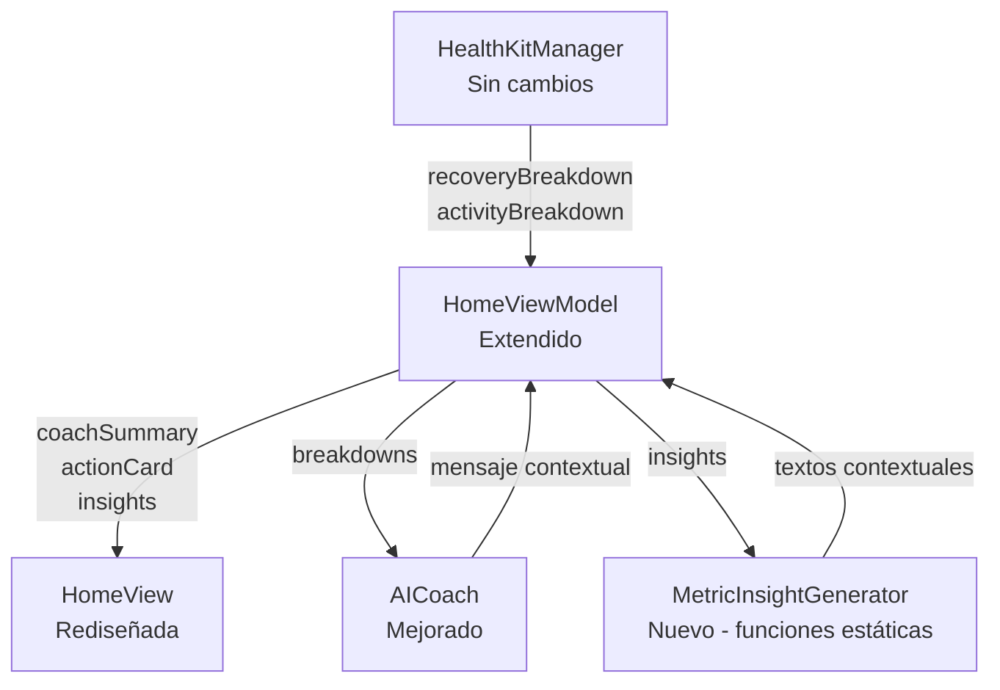

# Diseño — Smart Home Dashboard

## Investigación de Referencia

Antes de diseñar, se investigaron las apps líderes en fitness/salud para identificar patrones UX probados:

- **WHOOP**: Tres diales compactos arriba (Sleep, Recovery, Strain) con deep dives. Coaching tips contextuales. Priorizan claridad y shortcuts. Rediseñaron su home basándose en feedback de usuarios que pedían "más foco en sueño, insights clave, y recomendaciones personalizadas". ([Fuente](https://www.whoop.com/en-gb/thelocker/the-all-new-whoop-home-screen/))
- **Oura**: Un número grande que resume tu estado ("Readiness") con la palabra "Optimal" o equivalente. La pestaña "Today" muestra solo lo más relevante para ese día — cambia dinámicamente. Usa 4 niveles con colores: Thriving (azul), Looking Good (verde), Room to Improve (amarillo), Needs Care (rojo). ([Fuente](https://support.ouraring.com/hc/en-us/articles/360058599753-How-to-Use-the-Oura-App))
- **Apple Fitness**: Actividad diaria arriba (calorías, pasos, distancia) para evaluación instantánea. Diseño limpio sin sobrecarga. Layouts adaptativos que cambian de detallados post-workout a mínimos durante ejercicio.

**Patrones comunes identificados:**
1. Un score principal + una palabra/frase que lo explica + color
2. "One big thing" — mostrar lo que importa HOY, no todo a la vez
3. Insights contextuales que cambian según el día (no siempre los mismos)
4. Colores consistentes para estados (rojo → descanso, verde → óptimo)
5. Deep dives opcionales — la info detallada está ahí pero no abruma

## Resumen

Este diseño transforma el Home Dashboard de Super Fitness Coach de una pantalla de datos numéricos crudos a un coach inteligente que comunica en lenguaje natural, inspirado en los patrones probados de WHOOP, Oura y Apple Fitness. El cambio es exclusivamente en la capa de presentación y lógica de mensajes: **los algoritmos de scoring en `HealthKitManager` NO se modifican**.

Los cambios principales son:
1. **AICoach mejorado**: Recibe `ScoreBreakdown` completo en lugar de solo scores numéricos, genera mensajes en español que referencian métricas específicas.
2. **Generador de insights por métrica**: Nueva lógica pura que convierte cada `ScoreComponent` en un mensaje contextual legible (estilo Oura "Today").
3. **HomeViewModel extendido**: Expone el coach summary, action card, etiquetas descriptivas e insights como propiedades computadas/derivadas.
4. **HomeView rediseñada**: Nueva jerarquía visual con Coach Summary arriba (estilo Oura "one big thing"), Action Card, scores compactos con etiquetas descriptivas (estilo WHOOP diales), e insights contextuales en el breakdown.

## Arquitectura

La arquitectura existente se mantiene intacta. Los cambios se limitan a 3 archivos existentes:



**Flujo de datos:**
1. `HealthKitManager` calcula scores y breakdowns (sin cambios)
2. `HomeViewModel` pasa los breakdowns a `AICoach` y `MetricInsightGenerator`
3. `AICoach.generateMessage()` recibe `ScoreBreakdown` y genera el coach summary en español
4. `MetricInsightGenerator` convierte cada `ScoreComponent` en un `MetricInsight` con texto contextual
5. `HomeView` presenta la nueva jerarquía visual

**Decisión de diseño**: Se agrega `MetricInsightGenerator` como un `struct` con funciones estáticas puras dentro de un nuevo archivo, en lugar de sobrecargar `AICoach`, porque la generación de insights por métrica es una responsabilidad distinta a la generación del mensaje principal del coach. Esto mantiene ambos módulos testables de forma independiente.

## Componentes e Interfaces

### 1. AICoach (modificado)

```swift
// AICoach.swift — firma actualizada
struct AICoach {
    /// Genera mensaje contextual del coach basado en breakdowns completos.
    /// El mensaje está en español y referencia métricas específicas.
    static func generateMessage(
        userName: String,
        recoveryScore: Int,
        activityScore: Int,
        recoveryBreakdown: ScoreBreakdown?,
        streakDays: Int,
        recentWorkoutCount: Int
    ) -> String

    /// Extrae el primer nombre del nombre completo.
    private static func extractFirstName(from name: String) -> String

    /// Identifica el componente con peor normalizedScore del breakdown.
    static func worstComponent(from breakdown: ScoreBreakdown) -> ScoreBreakdown.ScoreComponent?

    /// Genera la razón contextual basada en el peor componente.
    static func contextualReason(from breakdown: ScoreBreakdown) -> String
}
```

**Cambios clave:**
- Nuevo parámetro `recoveryBreakdown: ScoreBreakdown?` para acceder a métricas individuales
- Mensajes generados en español
- Reglas expandidas que referencian componentes específicos (sueño < 6h, HR elevada, HRV bajo)
- Cuando `recoveryBreakdown` es `nil`, se comporta como antes (fallback a mensajes genéricos)

### 2. MetricInsightGenerator (nuevo)

```swift
// MetricInsightGenerator.swift
struct MetricInsight {
    let metricName: String      // "Sueño", "Frecuencia Cardíaca", "HRV", "Pasos", "Calorías"
    let message: String         // "Dormiste 5.2h de tu meta de 8h — te faltaron 2.8h"
    let status: ScoreBreakdown.ComponentStatus  // .warning, .normal, .good
}

struct MetricInsightGenerator {
    /// Genera insights contextuales para todos los componentes de un breakdown.
    static func generateInsights(
        from breakdown: ScoreBreakdown,
        config: FitnessConfig
    ) -> [MetricInsight]

    /// Genera insight individual para un componente.
    static func generateInsight(
        for component: ScoreBreakdown.ScoreComponent,
        config: FitnessConfig
    ) -> MetricInsight
}
```

**Reglas de generación de mensajes por métrica:**

| Métrica | Status | Ejemplo de mensaje |
|---------|--------|-------------------|
| Sleep | warning | "Dormiste 5.2h de tu meta de 8h — te faltaron 2.8h 😴" |
| Sleep | normal | "Dormiste 6.5h — cerca de tu meta de 8h" |
| Sleep | good | "Buen descanso: 8.2h de sueño ✓" |
| Resting HR | warning | "Tu FC en reposo (75 bpm) está elevada vs tu promedio (62 bpm) — señal de fatiga" |
| Resting HR | normal | "FC en reposo normal: 64 bpm" |
| Resting HR | good | "FC en reposo baja: 58 bpm — buena recuperación ✓" |
| HRV | warning | "Tu variabilidad cardíaca (32ms) está baja — menor recuperación" |
| HRV | good | "HRV alto (72ms) — tu sistema nervioso está bien recuperado ✓" |
| Steps | warning | "Llevas 2,300 de 10,000 pasos — ¡a moverse! 🚶" |
| Steps | good | "¡Gran actividad! 12,500 pasos hoy ✓" |
| Calories | warning | "150 de 500 kcal activas — aún queda camino" |
| Calories | good | "Meta de calorías cumplida: 520 kcal ✓" |

### 3. HomeViewModel (extendido)

```swift
// Nuevas propiedades expuestas
@Observable
final class HomeViewModel {
    // ... propiedades existentes ...

    // Nuevas propiedades derivadas
    private(set) var coachSummary: String = ""
    private(set) var coachEmoji: String = "🟡"
    private(set) var actionCardTitle: String = ""
    private(set) var actionCardIntensity: ActionIntensity = .medium
    private(set) var recoveryLabel: String = ""
    private(set) var activityLabel: String = ""
    private(set) var recoveryInsights: [MetricInsight] = []
    private(set) var activityInsights: [MetricInsight] = []

    enum ActionIntensity {
        case low, medium, high

        var label: String { ... }   // "Baja", "Media", "Alta"
        var color: String { ... }   // rojo, naranja, verde
    }
}
```

**Lógica de etiquetas descriptivas (inspirada en los 4 niveles de Oura):**
- Recovery: `0-39` → "Necesitas descanso" (rojo), `40-69` → "Recuperación moderada" (naranja), `70-84` → "Buena recuperación" (verde), `85-100` → "Recuperación óptima" (azul)
- Activity: `0-39` → "Día tranquilo" (naranja), `40-69` → "En progreso" (azul), `70-84` → "Muy activo" (verde), `85-100` → "Excelente actividad" (verde brillante)

**Lógica de Action Card:**
- `recoveryScore < 40` → Descanso activo / Estiramiento (intensidad baja), ignora entrenamiento programado
- `recoveryScore 40-69` → Entrenamiento programado a intensidad moderada
- `recoveryScore >= 70` → Entrenamiento programado a intensidad completa

### 4. HomeView (rediseñada)

**Principio de diseño (de la investigación):** "One big thing" — al abrir la app, el usuario debe entender su estado en 2 segundos. Los detalles están disponibles pero no abruman. Inspirado en Oura Today + WHOOP diales compactos.

**Nueva jerarquía visual:**
```
┌─────────────────────────────┐
│ 🟢 Coach Summary            │  ← "One big thing" (estilo Oura Today)
│ "Estás listo para entrenar  │     Fondo coloreado según estado
│  fuerte hoy"                │     Texto grande, claro, en español
├─────────────────────────────┤
│ Hoy: Entrenamiento fuerza   │  ← Action Card con intensidad
│ Intensidad: ████████░░ Alta │     Color según recovery
├─────────────────────────────┤
│ 🟢 72  Buena recuperación   │  ← Score compacto (estilo WHOOP dial)
│ ▼ Detalles                  │     Número + etiqueta + color en una línea
│   ✓ Buen descanso: 7.8h    │  ← Insights contextuales (no técnicos)
│   ✓ FC reposo normal: 62bpm│     Solo texto humano, sin pesos ni %
│   ✓ HRV alto: 68ms         │
├─────────────────────────────┤
│ 🔵 55  En progreso          │  ← Activity compacto
│ ▼ Detalles                  │
│   🚶 6,200 de 10,000 pasos │
│   ⚡ 280 de 500 kcal        │
├─────────────────────────────┤
│ ⭐ 1,250 puntos             │
│ 💧 Detox Día 3 de 7        │
├─────────────────────────────┤
│ [  ▶ Iniciar Rutina  ]     │
└─────────────────────────────┘
```

**Cambios en la vista:**
- Coach Summary como primer `VStack` con fondo coloreado según estado — el elemento más prominente
- Action Card como nueva sección entre summary y scores
- Scores compactos: número ~48pt + etiqueta descriptiva + indicador de color en una línea horizontal (no el número gigante de 72pt actual)
- Breakdown expandido muestra `MetricInsight.message` en vez del breakdown técnico con pesos y porcentajes
- Se eliminan los porcentajes de peso y normalizedScore del breakdown visible al usuario
- Se mantienen todos los `accessibilityLabel` existentes y se agregan nuevos para coach summary y action card

## Modelos de Datos

### Modelos nuevos

```swift
/// Insight contextual generado para una métrica individual.
struct MetricInsight {
    let metricName: String
    let message: String
    let status: ScoreBreakdown.ComponentStatus
}
```

### Modelos existentes sin cambios

- `ScoreBreakdown` / `ScoreComponent` — se usa tal cual, sin modificaciones
- `HealthDataStatus<T>` — sin cambios
- `FitnessConfig` — sin cambios
- `StatusIndicator` (en HomeViewModel) — sin cambios en la lógica, solo se traducen labels a español

### Enum nuevo en HomeViewModel

```swift
enum ActionIntensity {
    case low, medium, high

    var label: String {
        switch self {
        case .low: return "Baja"
        case .medium: return "Media"
        case .high: return "Alta"
        }
    }

    var systemColor: String {
        switch self {
        case .low: return "red"
        case .medium: return "orange"
        case .high: return "green"
        }
    }
}
```

### Mapeo de datos existentes → nuevas propiedades

| Dato existente | Nueva propiedad | Transformación |
|---|---|---|
| `recoveryScore` | `recoveryLabel` | 4 niveles (estilo Oura): <40 → "Necesitas descanso", 40-69 → "Recuperación moderada", 70-84 → "Buena recuperación", 85-100 → "Recuperación óptima" |
| `activityScore` | `activityLabel` | 4 niveles: <40 → "Día tranquilo", 40-69 → "En progreso", 70-84 → "Muy activo", 85-100 → "Excelente actividad" |
| `recoveryBreakdown` | `recoveryInsights` | `MetricInsightGenerator.generateInsights(from:config:)` |
| `activityBreakdown` | `activityInsights` | `MetricInsightGenerator.generateInsights(from:config:)` |
| `recoveryScore` + `todayWorkoutType` | `actionCardTitle` + `actionCardIntensity` | Lógica de intensidad basada en recovery |
| `AICoach.generateMessage(...)` | `coachSummary` + `coachEmoji` | AICoach mejorado con breakdowns |


## Propiedades de Correctitud

*Una propiedad es una característica o comportamiento que debe cumplirse en todas las ejecuciones válidas de un sistema — esencialmente, una declaración formal sobre lo que el sistema debe hacer. Las propiedades sirven como puente entre especificaciones legibles por humanos y garantías de correctitud verificables por máquina.*

### Propiedad 1: Coach Summary mapea Recovery Score al estado correcto

*Para cualquier* recovery score en [0, 100], nombre de usuario, y ScoreBreakdown opcional, el mensaje generado por `AICoach.generateMessage()` debe contener la palabra clave del estado correspondiente al rango del score (descanso/descansar para 0-39, moderado/moderada para 40-69, entrenar fuerte/listo para 70-100) y el emoji del coach debe ser 🔴 para 0-39, 🟡 para 40-69, 🟢 para 70-100.

**Valida: Requisitos 1.1, 1.2, 1.3, 1.4, 1.6**

### Propiedad 2: Action Card mapea Recovery Score a intensidad correcta

*Para cualquier* recovery score en [0, 100] y cualquier tipo de entrenamiento programado, la intensidad del Action Card debe ser `.low` cuando el score es 0-39, `.medium` cuando es 40-69, y `.high` cuando es 70-100. Además, cuando el score es 0-39, el título del action card debe recomendar descanso/actividad ligera independientemente del entrenamiento programado.

**Valida: Requisitos 2.2, 2.3, 2.4**

### Propiedad 3: Insight Generator produce un insight por componente del breakdown

*Para cualquier* `ScoreBreakdown` con N componentes, `MetricInsightGenerator.generateInsights()` debe retornar exactamente N `MetricInsight`s, cada uno con un `message` no vacío y un `metricName` que corresponda al nombre del componente original.

**Valida: Requisito 3.1**

### Propiedad 4: Insight de sueño menciona déficit cuando está por debajo del 70% de la meta

*Para cualquier* componente de sueño con `rawValue < sleepGoalHours * 0.7`, el `MetricInsight` generado debe contener una referencia al déficit de horas (la diferencia entre la meta y el valor real).

**Valida: Requisito 3.2**

### Propiedad 5: Insight de FC en reposo menciona fatiga cuando está por encima del baseline

*Para cualquier* componente de Resting HR con status `.warning` (lo que indica que está significativamente por encima del baseline), el `MetricInsight` generado debe contener una referencia a fatiga o estrés.

**Valida: Requisito 3.3**

### Propiedad 6: Insight de HRV refleja correctamente la comparación con el baseline

*Para cualquier* componente de HRV, si el status es `.warning` o `.normal` (HRV por debajo o cerca del baseline), el mensaje debe indicar menor recuperación; si el status es `.good` (HRV por encima del baseline), el mensaje debe indicar buena recuperación del sistema nervioso.

**Valida: Requisitos 3.4, 3.5**

### Propiedad 7: Insight de pasos es motivacional cuando está por debajo del 50% de la meta

*Para cualquier* componente de Steps con `rawValue < stepsGoal * 0.5`, el `MetricInsight` generado debe contener un mensaje motivacional que sugiera incrementar la actividad.

**Valida: Requisito 3.6**

### Propiedad 8: El status del insight preserva el status del componente

*Para cualquier* `ScoreComponent`, el `MetricInsight` generado por `MetricInsightGenerator.generateInsight()` debe tener un `status` idéntico al `ComponentStatus` del componente de entrada.

**Valida: Requisito 3.7**

### Propiedad 9: AICoach referencia métricas en warning del breakdown

*Para cualquier* `ScoreBreakdown` que contenga al menos un componente con status `.warning`, y un recovery score < 70, el mensaje generado por `AICoach.generateMessage()` debe contener una referencia textual al nombre o concepto de al menos uno de los componentes en warning.

**Valida: Requisito 4.1**

### Propiedad 10: AICoach combina reconocimiento de streak con recomendación

*Para cualquier* streak ≥ 3 días, el mensaje generado por `AICoach.generateMessage()` debe contener tanto una referencia al número de días del streak como una recomendación basada en el estado actual de recuperación.

**Valida: Requisito 4.4**

### Propiedad 11: Etiqueta de score mapea al descriptor de rango correcto

*Para cualquier* score entero en [0, 100], la función de generación de etiqueta debe retornar los descriptores correctos según 4 niveles (inspirados en Oura): para recovery: "Necesitas descanso" (0-39), "Recuperación moderada" (40-69), "Buena recuperación" (70-84), "Recuperación óptima" (85-100); para activity: "Día tranquilo" (0-39), "En progreso" (40-69), "Muy activo" (70-84), "Excelente actividad" (85-100).

**Valida: Requisitos 6.1, 6.2, 6.3**

## Manejo de Errores

### Datos no disponibles

| Escenario | Comportamiento |
|---|---|
| `recoveryBreakdown` es `nil` | AICoach genera mensaje genérico sin referencias a métricas específicas. MetricInsights retorna array vacío. |
| `HealthDataStatus` es `.loading` | Dashboard muestra `ProgressView` con placeholder. Coach summary no se genera hasta que los datos estén disponibles. |
| `HealthDataStatus` es `.unavailable` | Dashboard muestra "--" para scores. Coach summary muestra mensaje genérico de bienvenida. |
| Componente individual falta en breakdown | `MetricInsightGenerator` solo genera insights para los componentes presentes. No falla si faltan HR o HRV. |

### Valores extremos

| Escenario | Comportamiento |
|---|---|
| Score = 0 | Se trata como rango bajo (0-39). Etiqueta y coach summary reflejan necesidad de descanso. |
| Score = 100 | Se trata como rango alto (70-100). Etiqueta y coach summary reflejan estado óptimo. |
| `userName` vacío | `extractFirstName` retorna string vacío. El mensaje se genera sin nombre. |
| `sleepGoalHours` = 0 | `MetricInsightGenerator` evita división por cero, retorna insight genérico. |

### Fallbacks

- Si `recoveryBreakdown` es `nil`, `AICoach` usa la lógica actual basada solo en scores numéricos (backward compatible).
- Si `FitnessConfig` no está disponible, se usa `.default`.
- Todos los mensajes tienen un caso default que evita retornar strings vacíos.

## Restricciones Críticas

1. **HealthKitManager.swift NO se modifica** — los algoritmos de scoring, queries de HealthKit, sleep detection, baselines automáticos, y toda la lógica de datos de salud se mantienen exactamente como están. Costó mucho trabajo llegar a datos precisos y no se arriesga.
2. **ScoreBreakdown / ScoreComponent NO se modifican** — se usan tal cual como fuente de datos para los nuevos insights.
3. **La lógica de `refreshHealthData()` NO se toca** — solo se consume su output de forma diferente en la capa de presentación.
4. **HomeViewModel mantiene backward compatibility** — las propiedades existentes (`recoveryScore`, `activityScore`, `statusIndicator`, etc.) siguen existiendo; las nuevas se agregan sin romper nada.

## Estrategia de Testing

### Enfoque dual

Se utilizan tanto tests unitarios como tests basados en propiedades para cobertura completa:

- **Tests unitarios**: Verifican ejemplos específicos, edge cases (1.7, 4.2, 4.3), y condiciones de error.
- **Tests de propiedades**: Verifican las 11 propiedades universales definidas arriba con inputs generados aleatoriamente.

### Librería de Property-Based Testing

Se usará **SwiftCheck** (o `swift-testing` con generadores custom si SwiftCheck no está disponible) para los tests de propiedades. Cada test ejecutará un mínimo de 100 iteraciones.

### Generadores necesarios

```swift
// Generadores para property-based testing
- Recovery score: Int aleatorio en [0, 100]
- Activity score: Int aleatorio en [0, 100]
- ScoreBreakdown: Componentes con rawValue, normalizedScore, weight, status aleatorios dentro de rangos válidos
- ScoreComponent: name de un set fijo ["Sleep", "Resting HR", "HRV", "Steps", "Active Calories"],
                   rawValue/rawUnit coherentes con el name, normalizedScore en [0, 100],
                   status derivado de normalizedScore
- FitnessConfig: Valores aleatorios dentro de rangos válidos
- userName: String no vacío aleatorio
- streakDays: Int aleatorio en [0, 365]
- WorkoutType: Caso aleatorio del enum existente
```

### Estructura de tests

```
Tests/
├── UnitTests/
│   ├── AICoachTests.swift          — Ejemplos específicos y edge cases (4.2, 4.3, 1.7)
│   ├── MetricInsightGeneratorTests.swift — Ejemplos de cada tipo de insight
│   └── HomeViewModelTests.swift    — Integración de labels, action card, coach summary
├── PropertyTests/
│   ├── AICoachPropertyTests.swift  — Propiedades 1, 9, 10
│   ├── MetricInsightPropertyTests.swift — Propiedades 3, 4, 5, 6, 7, 8
│   └── ScoreLabelPropertyTests.swift — Propiedades 2, 11
```

### Etiquetado de tests de propiedades

Cada test de propiedad debe incluir un comentario con el formato:
```swift
// Feature: smart-home-dashboard, Property 1: Coach Summary mapea Recovery Score al estado correcto
```

### Tests unitarios clave (ejemplos y edge cases)

| Test | Tipo | Valida |
|---|---|---|
| AICoach con sleep < 6h y recovery < 50 menciona sueño | Edge case | Req 4.2 |
| AICoach con HR > baseline * 1.1 menciona estrés cardiovascular | Edge case | Req 4.3 |
| AICoach con activity > 70 y recovery < 40 reconoce esfuerzo | Edge case | Req 1.7 |
| MetricInsight para sleep con rawValue = 0 | Edge case | Robustez |
| MetricInsight para breakdown vacío (0 componentes) | Edge case | Robustez |
| AICoach con breakdown nil genera mensaje genérico | Ejemplo | Backward compat |
| Action card con recovery = 39 (boundary) | Edge case | Req 2.2 |
| Action card con recovery = 40 (boundary) | Edge case | Req 2.3 |
| Action card con recovery = 70 (boundary) | Edge case | Req 2.4 |
| Score label con valores boundary (0, 39, 40, 69, 70, 100) | Edge case | Req 6.3 |
