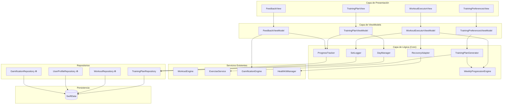
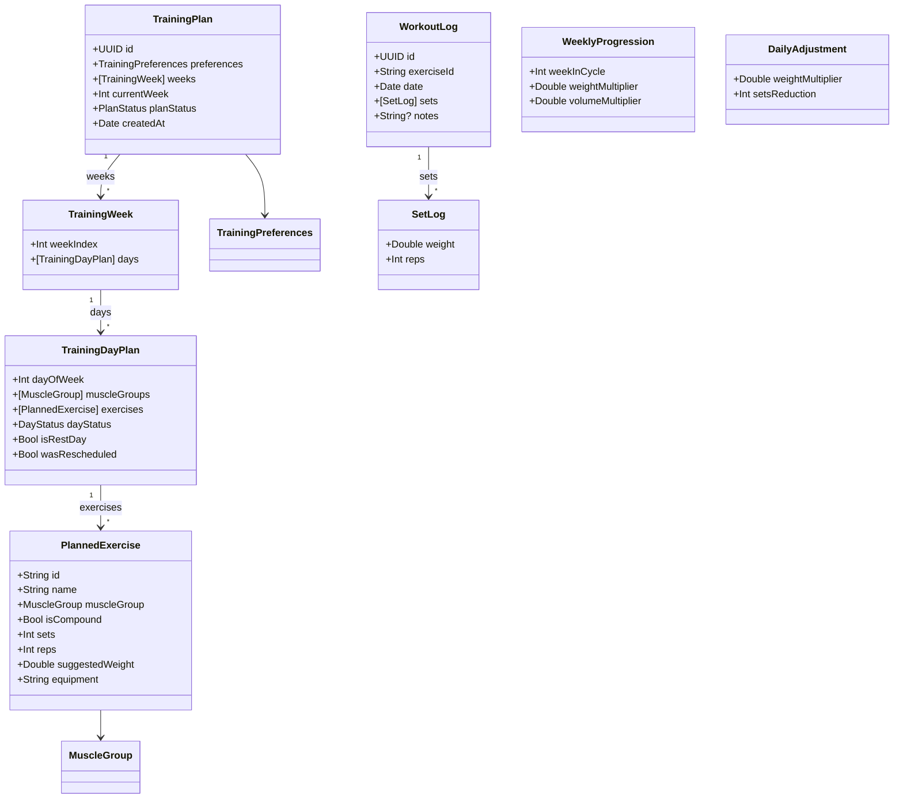
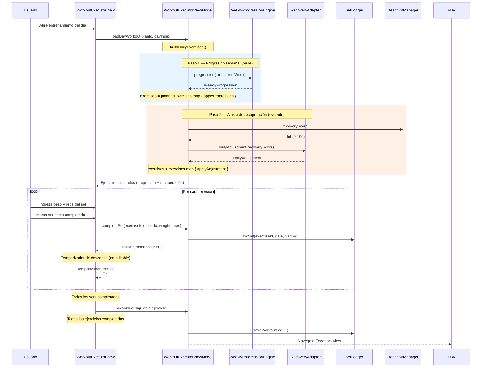

# Documento de Diseño — Smart Training Plan

## Resumen

Este documento describe el diseño técnico del sistema Smart Training Plan para la Super Fitness Coach App. El sistema permite al usuario configurar preferencias de entrenamiento (objetivo, días, nivel, músculos prioritarios, cardio, duración) y genera automáticamente un plan de 4-8 semanas con progresión semanal, ajuste diario por recuperación, registro de sets, seguimiento de progreso, gestión de días y gamificación.

El diseño se integra con los componentes existentes de la app: `WorkoutEngine`, `ExerciseService`, `GamificationEngine`, `HealthKitManager`, `WorkoutRepository` y los modelos `Exercise`, `WeeklyPlan`, `WorkoutSession`, `UserProfile`, `FitnessConfig`.

## Arquitectura

### Diagrama de Componentes



### Decisiones de Arquitectura

1. **Reutilización de `ExerciseService`**: Se usa el servicio existente para obtener ejercicios por bodyPart. Se mapean los `MuscleGroup` del nuevo sistema a los bodyParts que ya maneja la API.
2. **Nuevo `TrainingPlanRepository`**: Se crea un repositorio dedicado para las entidades del plan (TrainingPlan, WorkoutLog) separado del `WorkoutRepository` existente, que sigue manejando `WeeklyPlan` y `WorkoutSession` del sistema legacy.
3. **`RecoveryAdapter` consume `HealthKitManager`**: Lee el `recoveryScore` existente sin modificar HealthKitManager.
4. **`GamificationEngine` se extiende**: Se añade un nuevo `PointAction.trainingPlanCompleted` (100 pts) y se reutiliza `updateStreak` para rachas.
5. **MVVM con `@Observable`**: Consistente con el patrón existente en la app (HomeViewModel, WorkoutViewModel, etc.).

## Componentes e Interfaces

### 1. TrainingPlanGenerator (Core — Nuevo)

Motor principal de generación del plan. Funciones puras para cálculo de frecuencia, split y asignación de ejercicios.

```swift
import Foundation

struct TrainingPlanGenerator {

    // MARK: - Cálculo de Frecuencia Muscular (Req 2)

    /// Calcula la frecuencia semanal de cada grupo muscular.
    /// - Returns: Diccionario [MuscleGroup: Int] con frecuencia por músculo.
    static func calculateMuscleFrequency(
        trainingDaysPerWeek: Int,
        priorityMuscles: [MuscleGroup]
    ) -> [MuscleGroup: Int] { ... }

    /// Normaliza frecuencias para que la suma total sea distribuible
    /// dentro de trainingDaysPerWeek (máx 2 grupos por día).
    static func normalizeFrequencies(
        _ frequencies: [MuscleGroup: Int],
        trainingDaysPerWeek: Int
    ) -> [MuscleGroup: Int] { ... }

    // MARK: - Generación del Split Semanal (Req 3)

    /// Genera el arreglo de DayPlan distribuyendo grupos musculares.
    /// Garantiza que un grupo principal no se repita en días consecutivos.
    static func generateWeeklySplit(
        frequencies: [MuscleGroup: Int],
        trainingDaysPerWeek: Int,
        wantsCardio: Bool
    ) -> [TrainingDayPlan] { ... }

    // MARK: - Asignación de Ejercicios (Req 4)

    /// Asigna ejercicios a un día dado sus grupos musculares.
    /// Usa ExerciseService para obtener ejercicios y los ordena:
    /// compuestos primero, accesorios después.
    static func assignExercises(
        for muscleGroups: [MuscleGroup],
        from exercises: [Exercise],
        previousLogs: [WorkoutLog],
        exerciseCount: Int
    ) -> [PlannedExercise] { ... }

    // MARK: - Generación Completa del Plan (Req 1, 2, 3, 4)

    /// Genera un TrainingPlan completo a partir de las preferencias.
    static func generatePlan(
        preferences: TrainingPreferences,
        exercises: [Exercise],
        previousLogs: [WorkoutLog]
    ) -> TrainingPlan { ... }
}
```

### 2. WeeklyProgressionEngine (Core — Nuevo)

Calcula multiplicadores de peso y volumen según la semana actual dentro del ciclo de 4 semanas.

```swift
struct WeeklyProgressionEngine {

    /// Calcula la progresión para una semana dada del plan.
    /// Ciclo de 4 semanas: semana 1 = base, 2 = +5% peso, 3 = +10% volumen, 4 = deload.
    /// Para planes de 6 u 8 semanas, el ciclo se repite.
    static func progression(for currentWeek: Int) -> WeeklyProgression { ... }

    /// Aplica la progresión a un ejercicio planificado.
    static func applyProgression(
        to exercise: PlannedExercise,
        progression: WeeklyProgression
    ) -> PlannedExercise { ... }
}
```

### 3. RecoveryAdapter (Core — Nuevo)

Ajusta peso y sets según el recoveryScore del HealthKitManager.

```swift
struct RecoveryAdapter {

    /// Calcula el ajuste diario basado en el recoveryScore.
    static func dailyAdjustment(recoveryScore: Int) -> DailyAdjustment { ... }

    /// Aplica el ajuste a un ejercicio planificado.
    /// Garantiza mínimo 1 set después del ajuste.
    static func applyAdjustment(
        to exercise: PlannedExercise,
        adjustment: DailyAdjustment
    ) -> PlannedExercise { ... }
}
```

### 4. SetLogger (Core — Nuevo)

Registra sets individuales y persiste WorkoutLogs.

```swift
final class SetLogger {
    private let repository: TrainingPlanRepository

    init(repository: TrainingPlanRepository) { ... }

    /// Registra un set individual para un ejercicio.
    func logSet(
        exerciseId: String,
        date: Date,
        set: SetLog
    ) throws { ... }

    /// Guarda el WorkoutLog completo de un ejercicio.
    func saveWorkoutLog(_ log: WorkoutLog) throws { ... }

    /// Obtiene el WorkoutLog más reciente de un ejercicio.
    func latestLog(for exerciseId: String) throws -> WorkoutLog? { ... }
}
```

### 5. ProgressTracker (Core — Nuevo)

Calcula métricas de progreso comparando entrenamientos actuales vs anteriores.

```swift
struct ProgressTracker {

    /// Calcula el volumen total de un WorkoutLog: Σ(peso × reps) por set.
    static func totalVolume(from log: WorkoutLog) -> Double { ... }

    /// Obtiene el peso máximo de un WorkoutLog.
    static func maxWeight(from log: WorkoutLog) -> Double { ... }

    /// Obtiene las repeticiones máximas de un WorkoutLog.
    static func maxReps(from log: WorkoutLog) -> Int { ... }

    /// Compara el log actual con el anterior y retorna el ProgressStatus.
    /// Diferencia < 5% = stable, > 5% mejora = improving, < -5% = declining.
    static func compareProgress(
        current: WorkoutLog,
        previous: WorkoutLog?
    ) -> ProgressStatus { ... }
}
```

### 6. DayManager (Core — Nuevo)

Gestiona acciones sobre días del plan: completar, saltar, reprogramar.

```swift
final class DayManager {
    private let repository: TrainingPlanRepository

    init(repository: TrainingPlanRepository) { ... }

    /// Marca un día como completado.
    func completeDay(planId: UUID, dayIndex: Int) throws { ... }

    /// Marca un día como saltado.
    func skipDay(planId: UUID, dayIndex: Int) throws { ... }

    /// Reprograma un día al siguiente día disponible.
    /// Retorna false si no hay día disponible.
    func rescheduleDay(planId: UUID, dayIndex: Int) throws -> Bool { ... }

    /// Verifica si un día ya fue reprogramado (límite: 1 vez).
    func canReschedule(plan: TrainingPlan, dayIndex: Int) -> Bool { ... }

    /// Cuenta días consecutivos saltados para re-engagement.
    func consecutiveSkippedDays(plan: TrainingPlan) -> Int { ... }
}
```

### 7. TrainingPlanRepository (Repositorio — Nuevo)

```swift
final class TrainingPlanRepository {
    private let context: ModelContext

    init(context: ModelContext) { ... }

    func savePlan(_ plan: TrainingPlan) throws { ... }
    func fetchActivePlan() throws -> TrainingPlan? { ... }
    func saveWorkoutLog(_ log: WorkoutLog) throws { ... }
    func fetchLatestLog(exerciseId: String) throws -> WorkoutLog? { ... }
    func fetchLogs(exerciseId: String, limit: Int) throws -> [WorkoutLog] { ... }
}
```

### 8. Extensión de GamificationEngine (Existente — Modificado)

```swift
// Nuevo PointAction
extension PointAction {
    static let trainingPlanCompleted = PointAction.workoutCompleted // 100 pts via awardPoints
}

// Se reutiliza:
// - gamificationEngine.awardPoints(100, for: .workoutCompleted)
// - gamificationEngine.updateStreak(hasActionToday: true)
// - gamificationEngine.checkBadges()
```

Se otorgan 100 puntos por entrenamiento completado del plan (vs 20 del sistema legacy). Se usa `awardPoints` directamente con el valor 100.

### 9. ViewModels (Nuevos)

```swift
// TrainingPreferencesViewModel
@Observable
final class TrainingPreferencesViewModel {
    var goal: FitnessGoal = .gainMuscle
    var trainingDaysPerWeek: Int = 4
    var experienceLevel: FitnessLevel = .beginner
    var priorityMuscles: [MuscleGroup] = []
    var wantsCardio: Bool = false
    var planDurationWeeks: Int = 4

    func generatePlan() async { ... }
    func toggleMuscle(_ muscle: MuscleGroup) { ... }
}

// WorkoutExecutorViewModel
@Observable
final class WorkoutExecutorViewModel {
    private(set) var exercises: [PlannedExercise] = []
    private(set) var currentExerciseIndex: Int = 0
    private(set) var restTimerSeconds: Int = 0
    private(set) var isRestTimerActive: Bool = false

    private let plan: TrainingPlan
    private let plannedExercises: [PlannedExercise]
    private var recoveryScore: Int = 50

    /// Construye los ejercicios del día aplicando progresión semanal y luego ajuste de recuperación.
    /// **Orden crítico: progresión → recuperación (recovery manda).**
    /// La progresión semanal se aplica primero como base, y luego el ajuste de recuperación
    /// sobreescribe/modifica los valores. Esto garantiza que el estado físico del usuario
    /// siempre tenga la última palabra sobre la intensidad del entrenamiento.
    func buildDailyExercises() {
        let progression = WeeklyProgressionEngine.progression(for: plan.currentWeek)

        var exercises = plannedExercises.map {
            WeeklyProgressionEngine.applyProgression(to: $0, progression: progression)
        }

        let adjustment = RecoveryAdapter.dailyAdjustment(recoveryScore: recoveryScore)

        exercises = exercises.map {
            RecoveryAdapter.applyAdjustment(to: $0, adjustment: adjustment)
        }

        self.exercises = exercises
    }

    func completeSet(exerciseIndex: Int, setIndex: Int, weight: Double, reps: Int) { ... }
    func startRestTimer() { ... }
    func stopRestTimer() { ... }
}

// FeedbackViewModel
@Observable
final class FeedbackViewModel {
    private(set) var weightImprovements: [(exerciseName: String, delta: Double)] = []
    private(set) var consecutiveDays: Int = 0
    private(set) var hasImproving: Bool = false
    private(set) var isFirstWorkout: Bool = false
}
```

## Modelos de Datos

### Enumeraciones Nuevas

```swift
/// Grupos musculares disponibles para el plan.
enum MuscleGroup: String, Codable, CaseIterable, Identifiable {
    case chest, back, shoulders, biceps, triceps
    case quads, hamstrings, glutes, calves, core

    var id: String { rawValue }

    /// Clasificación según MusclePriority.
    var priority: MusclePriority {
        switch self {
        case .chest, .back, .quads: return .primary
        default: return .secondary
        }
    }

    /// Mapeo a bodyPart de ExerciseDB API (usado por ExerciseService).
    var apiBodyPart: String {
        switch self {
        case .chest: return "chest"
        case .back: return "back"
        case .shoulders: return "shoulders"
        case .biceps: return "upper arms"
        case .triceps: return "upper arms"
        case .quads: return "upper legs"
        case .hamstrings: return "upper legs"
        case .glutes: return "upper legs"
        case .calves: return "lower legs"
        case .core: return "waist"
        }
    }
}

enum MusclePriority: String, Codable {
    case primary
    case secondary
}

enum DayStatus: String, Codable {
    case pending
    case completed
    case skipped
    case rescheduled
}

enum PlanStatus: String, Codable {
    case active
    case completed
    case paused
}

enum ProgressStatus: String, Codable {
    case improving   // 🔼
    case stable      // ➖
    case declining   // 🔽
}
```

### Estructuras y Modelos Nuevos

```swift
/// Preferencias de entrenamiento capturadas en onboarding.
struct TrainingPreferences: Codable, Equatable {
    var goal: FitnessGoal
    var trainingDaysPerWeek: Int          // 3...6
    var experienceLevel: FitnessLevel
    var priorityMuscles: [MuscleGroup]    // máx 2
    var wantsCardio: Bool
    var planDurationWeeks: Int            // 4, 6, 8

    static let `default` = TrainingPreferences(
        goal: .gainMuscle,
        trainingDaysPerWeek: 4,
        experienceLevel: .beginner,
        priorityMuscles: [],
        wantsCardio: false,
        planDurationWeeks: 4
    )
}

/// Semana dentro del plan de entrenamiento (persistida con SwiftData).
/// **Nota:** SwiftData + arrays anidados = problemas de persistencia/query/actualización.
/// TrainingWeek como @Model facilita actualizar semanas individuales, hacer queries y analytics.
@Model
final class TrainingWeek {
    var weekIndex: Int
    var days: [TrainingDayPlan]

    init(weekIndex: Int, days: [TrainingDayPlan]) {
        self.weekIndex = weekIndex
        self.days = days
    }
}

/// Plan de entrenamiento completo (persistido con SwiftData).
@Model
final class TrainingPlan {
    @Attribute(.unique) var id: UUID
    var preferences: TrainingPreferences
    var weeks: [TrainingWeek]             // cada TrainingWeek es un @Model independiente
    var currentWeek: Int                  // 1-based
    var planStatus: PlanStatus
    var createdAt: Date

    init(preferences: TrainingPreferences, weeks: [TrainingWeek]) {
        self.id = UUID()
        self.preferences = preferences
        self.weeks = weeks
        self.currentWeek = 1
        self.planStatus = .active
        self.createdAt = Date()
    }
}

/// Día dentro del plan de entrenamiento.
struct TrainingDayPlan: Codable, Equatable {
    var dayOfWeek: Int                    // 1=Lun, 7=Dom
    var muscleGroups: [MuscleGroup]       // máx 2
    var exercises: [PlannedExercise]
    var dayStatus: DayStatus
    var isRestDay: Bool
    var wasRescheduled: Bool              // para limitar reprogramación a 1 vez

    init(dayOfWeek: Int, muscleGroups: [MuscleGroup], exercises: [PlannedExercise], isRestDay: Bool = false) {
        self.dayOfWeek = dayOfWeek
        self.muscleGroups = muscleGroups
        self.exercises = exercises
        self.dayStatus = .pending
        self.isRestDay = isRestDay
        self.wasRescheduled = false
    }
}

/// Ejercicio planificado dentro de un día.
struct PlannedExercise: Codable, Equatable, Identifiable {
    var id: String                        // exerciseId de Exercise
    var name: String
    var muscleGroup: MuscleGroup
    var isCompound: Bool
    var sets: Int                          // default 3
    var reps: Int                          // default 8-12
    var suggestedWeight: Double            // kg
    var equipment: String
    var gifUrl: String?
    var instructions: [String]
}

/// Registro de un entrenamiento completo para un ejercicio.
@Model
final class WorkoutLog {
    @Attribute(.unique) var id: UUID
    var exerciseId: String
    var date: Date
    var sets: [SetLog]
    var notes: String?

    init(exerciseId: String, date: Date, sets: [SetLog], notes: String? = nil) {
        self.id = UUID()
        self.exerciseId = exerciseId
        self.date = date
        self.sets = sets
        self.notes = notes
    }
}

/// Registro individual de un set.
struct SetLog: Codable, Equatable {
    var weight: Double                    // kg
    var reps: Int
}

/// Multiplicadores de progresión semanal.
struct WeeklyProgression: Codable, Equatable {
    var weekInCycle: Int                  // 1-4
    var weightMultiplier: Double          // 1.0, 1.05, 1.0, 0.9
    var volumeMultiplier: Double          // 1.0, 1.0, 1.1, 0.85
}

/// Ajuste diario basado en recuperación.
struct DailyAdjustment: Codable, Equatable {
    var weightMultiplier: Double          // 1.05, 1.0, 0.85
    var setsReduction: Int                // 0 o 1
}
```


### Diagrama de Modelos de Datos



### Algoritmo de Generación del Plan

#### Paso 1: Cálculo de Frecuencia Muscular (Req 2)

```
entrada: trainingDaysPerWeek, priorityMuscles
salida: [MuscleGroup: Int]

1. Para cada MuscleGroup:
   - Si trainingDaysPerWeek >= 4:
     - primary (chest, back, quads) → frecuencia = 2
     - secondary → frecuencia = 1
   - Si trainingDaysPerWeek < 4:
     - todos → frecuencia = 1

2. Para cada músculo en priorityMuscles:
   - frecuencia = min(frecuencia + 1, 3)

3. Validar: Σ frecuencias ≤ trainingDaysPerWeek × 2
   - Si excede, normalizar proporcionalmente:
     - factor = (trainingDaysPerWeek × 2) / Σ frecuencias
     - frecuencia[m] = max(1, round(frecuencia[m] × factor))
```

#### Paso 2: Generación del Split (Req 3)

```
entrada: frequencies, trainingDaysPerWeek, wantsCardio
salida: [TrainingDayPlan]

1. Crear slots = trainingDaysPerWeek días de entrenamiento
2. Si wantsCardio: reservar 1 slot para cardio
3. Distribuir grupos musculares en slots (máx 2 por día):
   - Usar greedy: asignar el músculo con mayor frecuencia restante
   - Restricción: no repetir grupo principal en días consecutivos
4. Insertar días de descanso distribuidos uniformemente en la semana de 7 días
5. Inicializar todos los días con dayStatus = .pending
```

#### Paso 3: Asignación de Ejercicios (Req 4)

```
entrada: muscleGroups del día, exercises disponibles, previousLogs
salida: [PlannedExercise] (4-6 ejercicios)

1. Para cada muscleGroup del día:
   - Filtrar exercises por apiBodyPart del muscleGroup
   - Seleccionar 1 ejercicio compuesto obligatorio (category == "compound" o heurística por nombre)
   - Completar con accesorios hasta alcanzar 4-6 total
2. Ordenar: compuestos primero, accesorios después
3. Asignar defaults: 3 sets, 10 reps
4. Peso sugerido:
   - Si existe WorkoutLog previo para exerciseId → usar último peso registrado
   - Si no → usar peso base por defecto (tabla estática por tipo de ejercicio)
```

### Motor de Progresión Semanal (Req 5)

```
entrada: currentWeek (1-based)
salida: WeeklyProgression

weekInCycle = ((currentWeek - 1) % 4) + 1

switch weekInCycle:
  case 1: weightMultiplier = 1.0,  volumeMultiplier = 1.0   // Base
  case 2: weightMultiplier = 1.05, volumeMultiplier = 1.0   // +5% peso
  case 3: weightMultiplier = 1.0,  volumeMultiplier = 1.1   // +10% volumen
  case 4: weightMultiplier = 0.9,  volumeMultiplier = 0.85  // Deload
```

### Adaptador de Recuperación (Req 6)

```
entrada: recoveryScore (0-100)
salida: DailyAdjustment

if recoveryScore >= 80:
  weightMultiplier = 1.05, setsReduction = 0
else if recoveryScore >= 50:
  weightMultiplier = 1.0,  setsReduction = 0
else:  // < 50
  weightMultiplier = 0.85, setsReduction = 1

// Post-ajuste: sets = max(1, sets - setsReduction)
```

### Flujo de Ejecución del Entrenamiento (Req 7)

> **Regla crítica — Orden de aplicación: progresión → recuperación (recovery manda).**
> La progresión semanal se aplica primero como base de intensidad, y luego el ajuste de recuperación sobreescribe/modifica los valores resultantes. Esto garantiza que el estado físico actual del usuario siempre tenga la última palabra sobre la intensidad del entrenamiento. Ver `buildDailyExercises()` en `WorkoutExecutorViewModel`.



### Registro de Sets (Req 8)

El `SetLogger` persiste cada set de forma individual dentro de un `WorkoutLog`:

1. Al completar un set, se crea un `SetLog(weight, reps)` y se añade al `WorkoutLog` en memoria.
2. Se persiste inmediatamente vía `TrainingPlanRepository.saveWorkoutLog()`.
3. El peso y reps son editables antes de finalizar el ejercicio (el usuario puede modificar sets previos).
4. Al finalizar el ejercicio, se guarda la nota opcional si fue ingresada.

### Seguimiento de Progreso (Req 9)

```swift
// Cálculo de ProgressStatus
let currentVolume = ProgressTracker.totalVolume(from: currentLog)
let previousVolume = ProgressTracker.totalVolume(from: previousLog)

let delta = (currentVolume - previousVolume) / previousVolume

if delta > 0.05 → .improving
if delta < -0.05 → .declining
else → .stable

// Si no hay previousLog → .stable (default)
```

Se comparan también `maxWeight` y `maxReps` como métricas complementarias. El `ProgressStatus` principal se basa en volumen total.

### Gestión de Días (Req 10)

- **Completar**: `dayStatus = .completed`
- **Saltar**: `dayStatus = .skipped` (no modifica otros días)
- **Reprogramar**: `dayStatus = .rescheduled`, mueve el entrenamiento al siguiente día con `dayStatus == .pending && isRestDay == true`. Si no hay día disponible, informa al usuario. Límite: 1 reprogramación por día (`wasRescheduled`).
- **Re-engagement**: Si `consecutiveSkippedDays >= 3`, se dispara un mensaje motivacional.
- **Inicialización**: Todos los días inician con `dayStatus = .pending`.

### Integración con Gamificación (Req 11)

```swift
// Al completar un entrenamiento del plan:
gamificationEngine.awardPoints(100, for: .workoutCompleted)
gamificationEngine.updateStreak(hasActionToday: true)
let newBadges = gamificationEngine.checkBadges()

// Bonificación por racha >= 3 días:
if gamificationEngine.currentStreak >= 3 {
    let bonus = gamificationEngine.currentStreak * 10  // 30, 40, 50...
    gamificationEngine.awardPoints(bonus, for: .workoutCompleted)
}
```

### Feedback Post-Entrenamiento (Req 12)

La `FeedbackView` muestra:
1. Mejoras de peso por ejercicio (delta vs entrenamiento anterior del mismo exerciseId).
2. Días consecutivos de entrenamiento (`gamificationEngine.currentStreak`).
3. Indicador 🔼 si al menos un ejercicio tiene `ProgressStatus.improving`.
4. Si no hay datos previos: mensaje de bienvenida sin métricas de comparación.

### Estrategia de Persistencia (Req 13)

Se usa SwiftData con las siguientes entidades:

| Entidad | Estado | Descripción |
|---------|--------|-------------|
| `UserProfile` | Existente | Se le añade `trainingPreferences: TrainingPreferences?` |
| `TrainingPlan` | Nuevo `@Model` | Plan completo con semanas, estado |
| `TrainingWeek` | Nuevo `@Model` | Semana individual con días (reemplaza array anidado) |
| `WorkoutLog` | Nuevo `@Model` | Registro de entrenamiento por ejercicio |
| `GamificationState` | Existente | Se reutiliza sin cambios |

El `ModelContainer` en `Super_Fitness_Coach_AppApp.swift` se extiende:
```swift
.modelContainer(for: [
    UserProfile.self,
    WeeklyPlan.self,
    WorkoutSession.self,
    GamificationState.self,
    DetoxProgress.self,
    TrainingPlan.self,    // Nuevo
    TrainingWeek.self,    // Nuevo
    WorkoutLog.self       // Nuevo
])
```


## Propiedades de Correctitud

*Una propiedad es una característica o comportamiento que debe mantenerse verdadero en todas las ejecuciones válidas de un sistema — esencialmente, una declaración formal sobre lo que el sistema debe hacer. Las propiedades sirven como puente entre especificaciones legibles por humanos y garantías de correctitud verificables por máquina.*

### Property 1: Cálculo de frecuencia muscular respeta reglas de prioridad y días

*Para cualquier* `trainingDaysPerWeek` en 3...6 y cualquier `priorityMuscles` (0-2 elementos), el diccionario de frecuencias resultante debe cumplir:
- Si `trainingDaysPerWeek >= 4`: grupos primary tienen frecuencia base 2, secondary frecuencia base 1
- Si `trainingDaysPerWeek < 4`: todos tienen frecuencia base 1
- Cada músculo en `priorityMuscles` tiene frecuencia incrementada en 1 (máx 3)
- La suma total de frecuencias es ≤ `trainingDaysPerWeek × 2`

**Validates: Requirements 1.4, 2.1, 2.2, 2.3, 2.4, 2.5**

### Property 2: Límite de músculos prioritarios

*Para cualquier* intento de seleccionar más de 2 músculos prioritarios, el sistema debe rechazar la selección y mantener el array con máximo 2 elementos.

**Validates: Requirements 1.3**

### Property 3: Split genera días correctos con descanso distribuido

*Para cualquier* `trainingDaysPerWeek` en 3...6 y frecuencias válidas, el split generado debe tener exactamente `trainingDaysPerWeek` días de entrenamiento y `7 - trainingDaysPerWeek` días de descanso, sumando siempre 7 días.

**Validates: Requirements 3.1, 3.5**

### Property 4: Máximo 2 grupos musculares por día

*Para cualquier* split generado, cada día de entrenamiento debe tener como máximo 2 grupos musculares asignados.

**Validates: Requirements 3.2**

### Property 5: Grupos musculares principales no se repiten en días consecutivos

*Para cualquier* split generado, ningún grupo muscular con prioridad `primary` debe aparecer en dos días de entrenamiento consecutivos.

**Validates: Requirements 3.3**

### Property 6: Ejercicios por día entre 4 y 6 con al menos 1 compuesto por grupo principal

*Para cualquier* día de entrenamiento con ejercicios asignados, el número de ejercicios debe estar entre 4 y 6, y por cada grupo muscular principal del día debe existir al menos 1 ejercicio compuesto.

**Validates: Requirements 4.1, 4.2**

### Property 7: Ejercicios compuestos antes que accesorios

*Para cualquier* lista de ejercicios de un día, todos los ejercicios con `isCompound == true` deben aparecer antes que cualquier ejercicio con `isCompound == false`.

**Validates: Requirements 4.5**

### Property 8: Defaults de sets y reps

*Para cualquier* ejercicio en un plan recién generado (sin progresión ni recuperación aplicada), `sets` debe ser 3 y `reps` debe estar en el rango 8...12.

**Validates: Requirements 4.6**

### Property 9: Ciclo de progresión semanal de 4 semanas

*Para cualquier* `currentWeek` ≥ 1, la progresión debe seguir el ciclo de 4 semanas:
- `weekInCycle = ((currentWeek - 1) % 4) + 1`
- Semana 1: weightMultiplier = 1.0, volumeMultiplier = 1.0
- Semana 2: weightMultiplier = 1.05, volumeMultiplier = 1.0
- Semana 3: weightMultiplier = 1.0, volumeMultiplier = 1.1
- Semana 4: weightMultiplier = 0.9, volumeMultiplier = 0.85

**Validates: Requirements 5.1, 5.2, 5.3, 5.4, 5.5**

### Property 10: Ajuste de recuperación según umbrales

*Para cualquier* `recoveryScore` en 0...100, el `DailyAdjustment` debe cumplir:
- recoveryScore ≥ 80 → weightMultiplier = 1.05, setsReduction = 0
- 50 ≤ recoveryScore ≤ 79 → weightMultiplier = 1.0, setsReduction = 0
- recoveryScore < 50 → weightMultiplier = 0.85, setsReduction = 1

**Validates: Requirements 6.1, 6.2, 6.3**

### Property 11: Mínimo 1 set después de ajuste de recuperación

*Para cualquier* ejercicio con cualquier número de sets ≥ 1 y cualquier `DailyAdjustment`, después de aplicar el ajuste el número de sets debe ser ≥ 1.

**Validates: Requirements 6.4**

### Property 12: Ajuste de recuperación no modifica ejercicios

*Para cualquier* lista de ejercicios y cualquier `DailyAdjustment`, después de aplicar el ajuste: la cantidad de ejercicios, sus IDs, nombres y orden deben permanecer idénticos. Solo cambian `suggestedWeight` y `sets`.

**Validates: Requirements 6.5**

### Property 13: Comparación de progreso por volumen

*Para cualquier* par de `WorkoutLog` (actual y anterior) del mismo `exerciseId`:
- Si volumen actual > volumen anterior × 1.05 → `improving`
- Si volumen actual < volumen anterior × 0.95 → `declining`
- Si la diferencia es < 5% → `stable`
- Si no existe log anterior → `stable`

Donde volumen = Σ(weight × reps) para todos los sets.

**Validates: Requirements 9.1, 9.3, 9.4, 9.5, 9.6, 9.7**

### Property 14: Saltar día preserva otros días

*Para cualquier* plan y día saltado, solo ese día debe cambiar a `dayStatus = .skipped`. Todos los demás días deben mantener su estado y ejercicios sin modificación.

**Validates: Requirements 10.2**

### Property 15: Reprogramar mueve al siguiente día disponible y preserva sesiones

*Para cualquier* plan con al menos un día disponible (pending + sin sesión), reprogramar un día debe:
- Marcar el día original como `rescheduled`
- Mover el entrenamiento al siguiente día disponible
- Preservar el número total de sesiones de entrenamiento en la semana

**Validates: Requirements 10.3, 10.4, 10.9**

### Property 16: Límite de reprogramación a una vez por día

*Para cualquier* día con `wasRescheduled == true`, `canReschedule` debe retornar `false`.

**Validates: Requirements 10.6**

### Property 17: Inicialización de días con estado pending

*Para cualquier* plan recién generado, todos los días deben tener `dayStatus == .pending`.

**Validates: Requirements 10.8**

### Property 18: Detección de 3 días consecutivos saltados

*Para cualquier* plan donde 3 o más días consecutivos tienen `dayStatus == .skipped`, `consecutiveSkippedDays` debe retornar un valor ≥ 3.

**Validates: Requirements 10.10**

### Property 19: WorkoutLog round-trip de persistencia

*Para cualquier* `WorkoutLog` válido (con exerciseId, date, sets con weight/reps, y notes opcional), guardar y luego recuperar debe producir un log equivalente con todos los campos preservados.

**Validates: Requirements 8.1, 8.3, 8.4, 13.1, 13.2, 13.3**

### Property 20: Gamificación otorga puntos correctos

*Para cualquier* entrenamiento completado, el sistema debe otorgar 100 puntos base. Si el streak actual es ≥ 3, debe otorgar una bonificación adicional de `streak × 10` puntos.

**Validates: Requirements 11.1, 11.2**

### Property 21: Inclusión de cardio cuando solicitado

*Para cualquier* plan generado con `wantsCardio == true`, al menos un día del split debe contener ejercicios de tipo cardio.

**Validates: Requirements 4.4**

### Property 22: Peso sugerido desde log previo o default

*Para cualquier* ejercicio asignado, si existe un `WorkoutLog` previo para ese `exerciseId`, el `suggestedWeight` debe basarse en el último peso registrado. Si no existe log previo, debe usar el peso base por defecto.

**Validates: Requirements 4.7**

## Manejo de Errores

| Escenario | Acción |
|-----------|--------|
| Error de persistencia SwiftData | Registrar en Logger, mostrar alerta al usuario indicando que los datos no se pudieron guardar (Req 13.4) |
| ExerciseService falla (API) | Usar `fallbackExercises` del bundle local (comportamiento existente) |
| HealthKit no autorizado | Usar recoveryScore = 50 (default), no aplicar ajuste de recuperación |
| No hay ejercicios para un bodyPart | Asignar ejercicios genéricos del grupo muscular más cercano |
| Plan sin días disponibles para reprogramar | Informar al usuario, mantener día en posición original (Req 10.5) |
| trainingDaysPerWeek fuera de rango | Clampar a 3...6 |
| priorityMuscles > 2 | Truncar a los primeros 2 seleccionados |
| WorkoutLog sin sets | Tratar como volumen 0, ProgressStatus = stable |

## Estrategia de Testing

### Enfoque Dual: Unit Tests + Property-Based Tests

Se utilizan ambos enfoques de forma complementaria:

- **Unit Tests**: Verifican ejemplos específicos, edge cases y condiciones de error.
- **Property-Based Tests**: Verifican propiedades universales con inputs generados aleatoriamente.

### Librería de Property-Based Testing

Se utiliza el enfoque de **Seeded RNG** (generador pseudo-aleatorio con semilla) ya establecido en el proyecto (`Tests/PropertyTests/SleepWindowValidationPropertyTests.swift`), usando Swift Testing (`@Test`) con un `SeededRNG` personalizado para generar inputs determinísticos.

Cada test de propiedad ejecuta un mínimo de **100 iteraciones**.

### Configuración de Tests de Propiedad

Cada test de propiedad debe incluir un comentario de referencia al diseño:

```swift
// Feature: smart-training-plan, Property 1: Cálculo de frecuencia muscular
```

Cada propiedad de correctitud debe ser implementada por un **único** test de propiedad.

### Tests de Propiedad Planificados

| Propiedad | Componente bajo test | Generador |
|-----------|---------------------|-----------|
| P1: Frecuencia muscular | `TrainingPlanGenerator.calculateMuscleFrequency` | Random trainingDays (3-6), random priorityMuscles (0-2) |
| P2: Límite priorityMuscles | `TrainingPreferencesViewModel.toggleMuscle` | Random MuscleGroup sequences |
| P3: Split días + descanso | `TrainingPlanGenerator.generateWeeklySplit` | Random frequencies, random days |
| P4: Máx 2 grupos/día | `TrainingPlanGenerator.generateWeeklySplit` | Random frequencies, random days |
| P5: No consecutivos primary | `TrainingPlanGenerator.generateWeeklySplit` | Random frequencies, random days |
| P6: Ejercicios 4-6 + compuesto | `TrainingPlanGenerator.assignExercises` | Random muscle groups, random exercises |
| P7: Orden compuestos | `TrainingPlanGenerator.assignExercises` | Random exercises |
| P8: Defaults sets/reps | `TrainingPlanGenerator.generatePlan` | Random preferences |
| P9: Ciclo progresión | `WeeklyProgressionEngine.progression` | Random currentWeek (1-100) |
| P10: Umbrales recuperación | `RecoveryAdapter.dailyAdjustment` | Random recoveryScore (0-100) |
| P11: Mín 1 set | `RecoveryAdapter.applyAdjustment` | Random exercises, random adjustments |
| P12: Ejercicios sin cambio | `RecoveryAdapter.applyAdjustment` | Random exercises, random adjustments |
| P13: Progreso por volumen | `ProgressTracker.compareProgress` | Random WorkoutLogs |
| P14: Skip preserva | `DayManager.skipDay` | Random plans, random day indices |
| P15: Reschedule | `DayManager.rescheduleDay` | Random plans with available days |
| P16: Límite reschedule | `DayManager.canReschedule` | Random plans with wasRescheduled flags |
| P17: Init pending | `TrainingPlanGenerator.generatePlan` | Random preferences |
| P18: 3 skips consecutivos | `DayManager.consecutiveSkippedDays` | Random plans with skip patterns |
| P19: WorkoutLog round-trip | `TrainingPlanRepository` | Random WorkoutLogs |
| P20: Gamificación puntos | `GamificationEngine.awardPoints` | Random streaks, random completions |
| P21: Cardio inclusión | `TrainingPlanGenerator.generateWeeklySplit` | Random frequencies with wantsCardio=true |
| P22: Peso sugerido | `TrainingPlanGenerator.assignExercises` | Random exercises with/without previous logs |

### Unit Tests Planificados

- Ejemplo: Generar plan con 4 días, objetivo gainMuscle, sin prioridades → verificar estructura esperada
- Ejemplo: Progresión semana 5 de plan de 8 semanas → debe ser igual a semana 1
- Edge case: trainingDaysPerWeek = 3 con 2 priorityMuscles → frecuencias normalizadas
- Edge case: Reprogramar cuando no hay días disponibles → retorna false
- Edge case: WorkoutLog sin sets → volumen = 0, status = stable
- Edge case: recoveryScore = 0 → ajuste máximo aplicado
- Edge case: recoveryScore = 100 → boost de peso aplicado
- Error: Persistencia falla → error propagado correctamente
